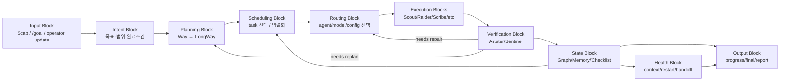
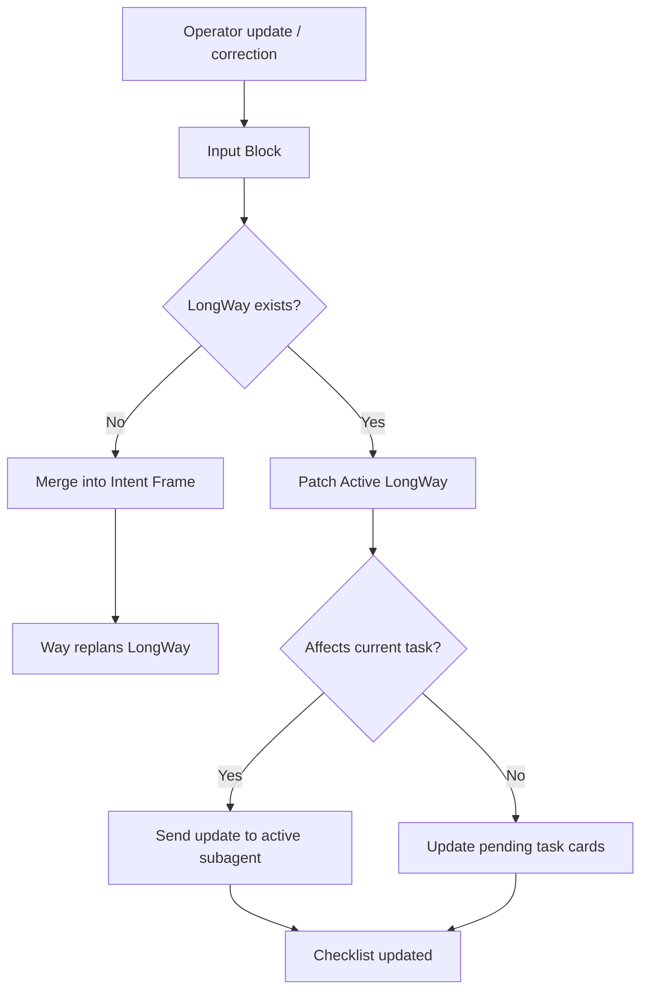
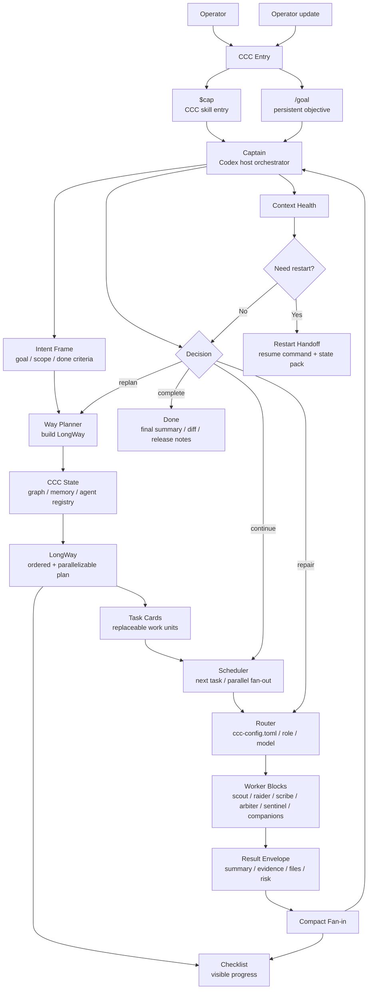

가능합니다.
**갈아엎는다면 핵심은 “CCC가 복잡한 Foreman 시스템”처럼 보이지 않게 하고, OMO/Sisyphus처럼 `목표 → 계획 → 작업카드 → 실행자 → 검증 → 다음 루프`만 반복하는 구조**로 만드는 게 좋습니다.

또 `/goal`은 현재 공식 slash command 문서에는 아직 명확히 올라와 있지 않지만, Codex CLI 0.128.0에서 `/goal <objective>`, `/goal pause`, `/goal resume`, `/goal clear` 형태가 확인되었다는 GitHub 이슈가 있고, goal이 활성 목표를 유지하면서 완료/중단/예산 제한까지 반복하는 구조로 설명됩니다. 공식 Codex CLI 문서에는 `/plan`, `/compact`, `/resume`, `/status` 등은 명시되어 있지만 `/goal`은 아직 문서화가 덜 된 상태로 보입니다. ([OpenAI 개발자][1])

## 추천 구조: CCC Sisyphus Loop

이 구조에서는 **cap은 CCC 진입점**, **/goal은 Codex CLI의 지속 실행 루프**, **CCC는 목표를 task card로 쪼개고 subagent에게 넘기는 블록형 실행 레이어**가 됩니다.

```mermaid id="ccc_sisyphus_loop"
flowchart TD
    user["Operator"] --> entry["Entry Layer"]

    entry --> cap["$cap CCC Request"]
    entry --> goal["/goal Persistent Objective"]

    cap --> captain["Captain<br/>Host Codex Orchestrator"]
    goal --> captain

    captain --> intent["Intent Frame<br/>목표/범위/완료조건 정리"]
    intent --> confirm{"Needs confirmation?"}

    confirm -->|Yes| ask["Ask operator briefly"]
    ask --> intent

    confirm -->|No| planner["Way Planner Block"]

    planner --> graph["CCC Graph / Agent Registry / Memory"]
    graph --> longway["LongWay<br/>작업 흐름"]
    longway --> cards["Task Cards"]

    cards --> scheduler["Sisyphus Scheduler<br/>next / parallel / blocked 판단"]

    scheduler --> router["Router Block<br/>ccc-config.toml 기반 라우팅"]

    router --> scout["Scout<br/>read / explore"]
    router --> raider["Raider<br/>code mutation"]
    router --> scribe["Scribe<br/>docs / release notes"]
    router --> arbiter["Arbiter<br/>review / verify"]
    router --> sentinel["Sentinel<br/>risk / guardrail"]
    router --> companion_reader["Companion Reader<br/>cheap read work"]
    router --> companion_operator["Companion Operator<br/>bounded tool work"]

    scout --> result["Result Envelope"]
    raider --> result
    scribe --> result
    arbiter --> result
    sentinel --> result
    companion_reader --> result
    companion_operator --> result

    result --> fanin["Compact Fan-in"]
    fanin --> checklist["LongWay Checklist<br/>operator-visible progress"]
    fanin --> captain

    captain --> decide{"Goal complete?"}

    decide -->|No| scheduler
    decide -->|Needs replan| planner
    decide -->|Needs repair| router
    decide -->|Yes| final["Final Answer / Commit / Release Summary"]

    captain --> context["Context Health Block"]
    context --> restart{"Context too long?"}
    restart -->|No| captain
    restart -->|Yes| handoff["Restart Handoff Pack<br/>resume 명령/현재상태/다음 task"]
```

## 이 구조의 핵심 해석

가장 중요한 변화는 **Way를 계속 복잡한 중심부로 두지 않는 것**입니다.

기존 구조에서는 `captain → way → longway → task card → routing → fan-in → captain → retry/replan`이 조금 무겁게 보였습니다.
갈아엎는다면 Way는 단순히 **Planner Block**입니다.

즉:

```text
Captain = 판단자 / 최종 책임자
Way = LongWay 생성기
Scheduler = 다음 task 선택기
Router = agent 배정기
Subagent = 실제 작업자
Arbiter/Sentinel = 검증/위험 확인 블록
Checklist = 사용자 진행 표시
Context Health = 재시작 판단 블록
```

이렇게 역할을 나누면 각 블록을 교체하기 쉽습니다.

## `/goal`과 `$cap`을 같이 쓰는 구조

`/goal`은 CCC 내부 기능으로 대체하려고 하기보다, **Codex CLI의 외부 지속 루프**로 쓰는 게 좋습니다.

예시는 이런 느낌입니다.

```text
/goal CCC 작업이 완료될 때까지 LongWay checklist를 기준으로 계속 진행한다.
$cap 이 repo에서 release 설치 흐름을 단순화하고, macOS/Linux/Windows 설치 검증까지 완료해줘.
```

이렇게 되면 역할이 나뉩니다.

```text
/goal = Codex가 멈추지 않고 목표를 계속 추적하게 하는 상위 루프
$cap = CCC 구조로 목표를 해석하고 subagent/task card로 실행하는 진입점
```

즉, `/goal`이 “계속 가라”를 담당하고, `$cap`이 “어떻게 나눠서 누구에게 맡길지”를 담당합니다.

## 블록 단위 교체 가능한 버전

구조를 더 모듈형으로 표현하면 이렇게 됩니다.



이게 제가 보기엔 가장 OMO/Sisyphus에 가깝습니다.

이 구조의 장점은 다음과 같습니다.

```text
Input Block 교체 가능:
- 지금은 $cap
- 나중에는 /goal + $cap
- 더 나중에는 /agent, /subagent, plugin command도 붙일 수 있음

Planning Block 교체 가능:
- 지금은 Way
- 나중에는 더 싼 모델의 planner
- 또는 graph planner로 교체 가능

Routing Block 교체 가능:
- 지금은 ccc-config.toml
- 나중에는 dynamic router
- 또는 cost-aware router로 교체 가능

Execution Block 교체 가능:
- scout, raider, scribe 추가/삭제 가능
- companion 계열도 독립적으로 교체 가능

Verification Block 교체 가능:
- arbiter만 쓰기
- sentinel 추가
- release-critical일 때만 strict review

Health Block 교체 가능:
- 처음에는 단순 context 길이 기준
- 나중에는 drift score / stale state / checklist mismatch 기준 추가
```

## 사용자 개입까지 포함한 단순 루프

중간 개입은 별도 복잡한 경로로 만들지 말고, **Input Block으로 다시 들어오게 하는 게 좋습니다.**



이렇게 하면 사용자가 중간에 말했을 때도 구조가 단순합니다.

* LongWay 전이면: 의도에 합쳐서 다시 계획
* LongWay 후이면: 현재 task card 또는 pending task card에 patch
* 이미 실행 중이면: 해당 subagent에게 추가 지시
* 아직 실행 전이면: task card만 업데이트

## 최종 추천 다이어그램

실제로 README나 설계 문서에 넣는다면 저는 아래 하나를 메인으로 추천합니다.



## 요약하면

갈아엎는다면 CCC는 이렇게 가는 게 좋습니다.

```text
$cap + /goal
→ Captain
→ Intent Frame
→ Way Planner
→ LongWay
→ Task Cards
→ Scheduler
→ Router
→ Worker Blocks
→ Result Envelope
→ Compact Fan-in
→ Captain Decision
→ 반복
```

그리고 핵심 원칙은 이겁니다.

> Way는 “계획 생성기”로 낮추고, Captain은 “판단자”로 유지하고, Scheduler/Router/Worker/Verifier/Health를 전부 블록화한다.

이렇게 하면 구조가 단순하면서도 OMO의 Sisyphus처럼 계속 밀고 가는 느낌을 만들 수 있고, `/goal`은 CCC 내부에 억지로 흡수하지 않고 **Codex CLI의 persistent objective loop**로 자연스럽게 같이 쓸 수 있습니다.

남은 반복 횟수: 0
초기화 일시: 2026-05-02 23:00 KST

[1]: https://developers.openai.com/codex/cli/slash-commands "Slash commands in Codex CLI | OpenAI Developers"
