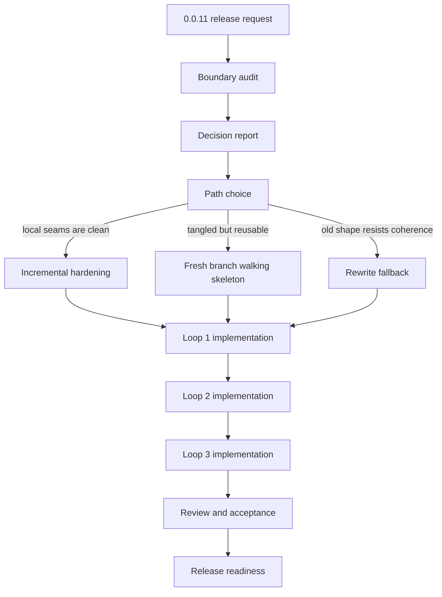
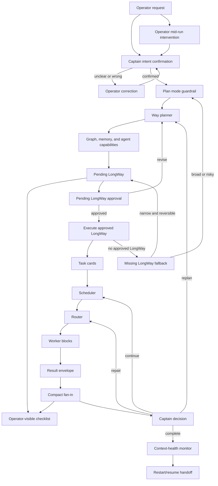
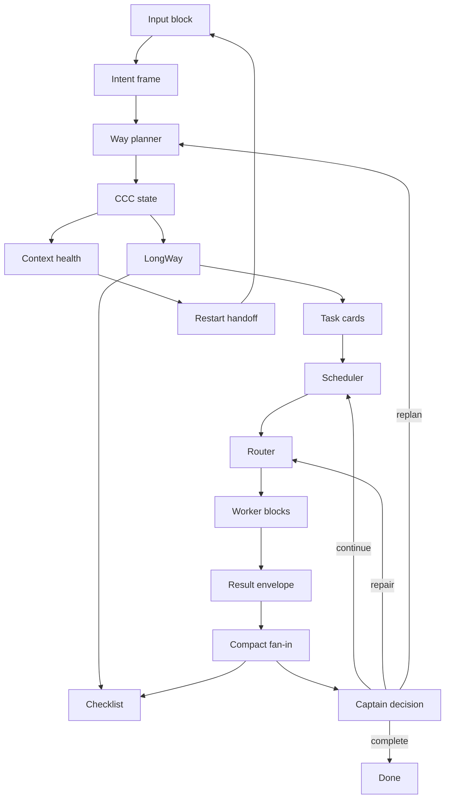

# 0.0.11 Pre-Release Plan

`0.0.11-pre` should harden CCC around the harness the operator is clearly trying to use, not just the harness CCC currently exposes.

## Release Goal

The current CCC direction is broadly right: captain-owned orchestration, Way as the bounded planning step, LongWay as the completion/checklist structure, and specialist fan-in as the truth source. That direction is still incomplete versus the operator's intended harness because the intent-confirmation gate, intervention timing, graph usage, and post-fan-in visibility are not yet tight enough to make the flow feel deterministic.

This release should close that gap by making the lifecycle explicit:

- captain confirms intent before any Way brief is generated for broad, risky, or ambiguous work
- planning and execution are separated into two explicit sequences
- Way only receives the brief after confirmation
- Way uses CCC graph, memory, and agent capabilities to create the LongWay
- Way produces a pending LongWay during the planning sequence, not an automatic execution path
- execution starts only after explicit operator approval of the pending LongWay
- captain routes from the LongWay and may assign bounded parallel work when the scope supports it
- operator intervention is classified differently before LongWay creation than after LongWay creation
- checklist progress remains visible per subagent and per task card after fan-in and merge
- context-health and restart/resume guidance become part of the normal handoff story
- active-run conflicts, retries, replans, and reclaims are handled as first-class harness states, not ad hoc exceptions
- audit-first release planning is required before any branch spike or broad implementation starts
- a decision report must sit between the boundary audit and any branch spike
- any fresh branch spike is conditional on that decision report and is limited to a walking skeleton
- implementation then proceeds in three loops instead of one broad pass

The release should also keep the documentation honest about fallback truth: if the operator-facing view and lifecycle artifacts disagree, the lifecycle artifacts, fan-in, and persisted run state win.

## Captain Assessment

My view is that the other AI's critique is mostly correct. `0.0.10` already has many of the needed primitives, but `0.0.11` should make them deterministic UX obligations rather than best-effort guidance. The release should treat intent confirmation, Way briefing, LongWay construction, routing, fan-in, intervention handling, and restart/resume as enforced harness behavior, not as loose operator advice.

There is also a serious possibility that the codebase accumulated features before the diagram and target harness were settled, which may have left lifecycle, routing, status, and context pieces tangled in a way that is harder to harden in place than to rebuild around a clean shape. `0.0.11` should treat that as the default investigation path, not as a pre-decided rewrite: audit the boundaries first, then choose the least risky path with tests and migration in view.

The operator-provided Sisyphus loop reference is preserved in
[`CCC_SISYPHUS_LOOP_REFERENCE.md`](./CCC_SISYPHUS_LOOP_REFERENCE.md). Treat it as
the design input for the 0.0.11 architecture spike. The reference intentionally
pushes CCC away from a large Foreman-shaped system and toward a small repeated
loop: goal, plan, task cards, worker blocks, verification, fan-in, captain
decision, then the next loop.

Official OpenAI Codex CLI slash-command documentation currently lists commands
such as `/plan`, `/compact`, `/resume`, and `/status`, but it does not list
`/goal` in the built-in slash-command table. The Codex app-server documentation
does expose experimental `thread/goal/set`, `thread/goal/get`, and
`thread/goal/clear` surfaces. Therefore 0.0.11 documentation should not claim
that CCC owns or implements `/goal`; it should describe `/goal` only as an
external or experimental persistent-objective surface that CCC can cooperate
with when the host Codex path exposes it.

Reference sources:

- OpenAI Codex CLI slash commands:
  https://developers.openai.com/codex/cli/slash-commands
- OpenAI Codex app-server API overview:
  https://developers.openai.com/codex/app-server
- OpenAI Codex best practices, Plan first for difficult tasks:
  https://developers.openai.com/codex/learn/best-practices
- OpenAI Codex app commands, `/plan-mode`:
  https://developers.openai.com/codex/app/commands

## Release Work Flow

This flow is for the 0.0.11 release effort itself. It is not the normal runtime
path for every `$cap` request.



## Runtime CCC Flow

This flow is the target operator experience for normal `$cap` work. Boundary
audit and branch-spike decisions do not run as part of every request.



## Sisyphus Loop Target

The preferred rebuild target is a CCC Sisyphus loop, not a broader Foreman
control system. Way should be lowered to a planner block. Captain remains the
judgment and accountability point. Scheduler, Router, Worker, Verification,
State, and Health become replaceable blocks.



Block responsibilities:

- Input block: `$cap`, operator updates, and any host persistent-objective
  surface such as `/goal` when available.
- Intent frame: goal, scope, constraints, and done criteria.
- Way planner: build LongWay only; do not let Way become the center of
  execution.
- Scheduler: choose next task, parallel fan-out, blocked work, and pending
  task-card updates.
- Router: choose role, model, and config-backed specialist.
- Worker blocks: scout, raider, scribe, arbiter, sentinel, and companions.
- Result envelope: summary, evidence, files, risk, checks, and open questions.
- Verification block: arbiter or sentinel checks when risk requires it.
- State block: graph, memory, LongWay, task cards, checklist, lifecycle, and
  fan-in truth.
- Health block: context pressure, stale state, drift risk, restart handoff, and
  resume command guidance.

## Plan / Execute Split

0.0.11 should make planning and execution separate sequences. The first `$cap`
turn produces a pending LongWay for operator review. The second explicit `$cap`
turn executes the approved LongWay. This matches Codex guidance to plan first
for complex or ambiguous work while preventing Way from becoming an implicit
execution engine.

Official Codex CLI best practices describe Plan mode as useful before
implementation for complex, ambiguous, or hard-to-describe tasks; it can gather
context, ask clarifying questions, and build a stronger plan before coding. The
Codex app command docs also describe `/plan-mode` as a toggle for multi-step
planning. CCC should use that shape as a product pattern, not as a claim that
Way directly controls Codex UI mode.

Before PLAN_SEQUENCE starts, Captain should ask the operator to confirm that
Codex Plan mode is active when the host UI supports it. The operator can use
`/plan` or Shift+Tab according to Codex CLI best-practice guidance. CCC cannot
assume it controls that UI state, so the check is an operator-facing guardrail:
confirm Plan mode when available, then keep CCC's own PLAN_SEQUENCE read-only.

CCC should support two entry paths:

- Plan-first path: use host Codex Plan mode plus CCC PLAN_SEQUENCE. This is the
  default for broad, risky, ambiguous, irreversible, release, branch, migration,
  or multi-file work.
- CCC-auto-LongWay path: let CCC create a compact LongWay without requiring host
  Plan mode first. This is acceptable for narrow, low-risk, reversible work
  where the operator explicitly asks to proceed and Captain states assumptions.

If the operator asks to execute but no approved LongWay exists, Captain must not
silently skip planning. It chooses exactly one fallback:

- For broad, risky, ambiguous, irreversible, release, branch, migration, or
  multi-file work: stop and ask the operator to run PLAN_SEQUENCE first.
- For narrow, low-risk, reversible work: create a compact CCC-auto-LongWay,
  state the assumptions, and continue only if the requested action remains
  within that small scope.
- If the work is already partially active: classify the operator request as an
  intervention and patch the Intent Frame, active task card, or pending task
  cards instead of creating a hidden side channel.

PLAN_SEQUENCE:

- Captain confirms the operator intent.
- Captain asks the operator to verify Plan mode with `/plan` or Shift+Tab when
  the host UI supports it.
- Captain calls Way only after the intent is confirmed.
- Way acts as a planner only and produces a pending LongWay.
- No code changes, file edits, commits, branch creation, release actions, or
  irreversible commands are allowed.
- Captain summarizes the pending LongWay, candidate task cards, parallelism,
  acceptance gates, risks, and expected specialist ownership.
- The sequence stops and waits for explicit operator approval.

EXECUTE_SEQUENCE:

- Starts only after the operator explicitly approves the pending LongWay in a
  later `$cap` request.
- Captain reloads or locates the approved LongWay before execution.
- If no approved LongWay exists, Captain applies the missing-LongWay fallback
  policy instead of executing silently.
- Captain confirms or creates task cards from the approved LongWay.
- Scheduler selects the next task or bounded parallel fan-out.
- Router assigns role, model, and config-backed worker blocks.
- Worker results return as Result Envelopes and Compact Fan-in.
- Checklist, fan-in, lifecycle artifacts, and persisted run state become the
  source of truth for progress and acceptance.

Replan behavior:

- If execution invalidates the approved LongWay, Captain returns to
  PLAN_SEQUENCE.
- The revised LongWay is summarized again and must be approved before broad
  execution continues.
- Narrow repairs may continue inside EXECUTE_SEQUENCE only when the current
  LongWay and acceptance gates still hold.

Recommended operator prompts:

```text
$cap Run the 0.0.11 work as PLAN_SEQUENCE. First summarize the operator intent and ask for confirmation. If confirmed, call Way as a planner and produce only a pending LongWay. In this sequence, code changes, file edits, commits, branch creation, and execution work are forbidden. When the LongWay is ready, summarize candidate task cards, parallelism, acceptance gates, risks, and expected specialist ownership for operator approval.
```

```text
$cap Run EXECUTE_SEQUENCE for the approved LongWay. Captain must reload or locate the approved LongWay, confirm task cards from it, and use Scheduler and Router to assign work to the correct specialist. After each work unit, update checklist and fan-in truth, then decide whether to continue, repair, retry, replan, reclaim, or complete.
```

```text
$cap This is a narrow low-risk task. Use CCC-auto-LongWay if an approved LongWay does not already exist. State assumptions, create a compact LongWay, keep the scope reversible, and stop for PLAN_SEQUENCE if the work becomes broad, risky, or ambiguous.
```

## Implementation Loops

- Loop 1
  - Intent Frame, Way Planner, LongWay, Task Cards, and Checklist
  - acceptance: the first loop produces a bounded intent frame, a Way plan
    that only plans, a LongWay that decomposes the work, task cards that match
    that decomposition, and a checklist that reflects the cards
  - validation: a small request can move from intent confirmation to LongWay to
    task cards without skipping the checklist

- Loop 2
  - Scheduler, Router, Worker Result Envelope, and Compact Fan-in
  - acceptance: the second loop can schedule the next card, route it to the
    right worker, return a structured result envelope, and fan the result in
    compactly enough for captain decision-making
  - validation: at least one worker result returns with evidence, status,
    open questions, and next action fields that survive fan-in

- Loop 3
  - Intervention, Review-retry-replan-reclaim, Context Health, and Restart Handoff
  - acceptance: the third loop can classify operator intervention, review the
    current state, retry or replan when needed, reclaim stale work, surface
    context health, and hand off restart guidance cleanly
  - validation: a mid-run operator update re-enters through the input block and
    changes only the intended frame, card, or pending work without a hidden
    side channel

## Required Features

- Captain intent confirmation loop
  - captain must confirm interpretation before generating a Way brief for broad, risky, ambiguous, or potentially irreversible work
  - simple or narrow work can still proceed with explicit assumptions, but the assumption must be visible

- Plan / Execute sequence split
  - plan sequence is read-only and produces a pending LongWay
  - execute sequence starts only after explicit operator approval
  - captain asks the operator to verify host Plan mode with `/plan` or
    Shift+Tab when available before PLAN_SEQUENCE
  - plan sequence must never mutate code, files, branches, commits, release
    assets, or external state
  - execute sequence must use the approved LongWay as its authority unless a
    replan is explicitly triggered
  - missing approved LongWay fallback must either return to PLAN_SEQUENCE or
    create a compact CCC-auto-LongWay for narrow, low-risk, reversible work

- Way brief gating
  - Way briefs only happen after confirmation
  - the brief should describe the role, stance, and expected outcome of the work, not just restate the request

- Way capability set
  - Way uses CCC graph, memory, and agent capabilities to create the LongWay
  - graph use should be visible as an intentional planning aid for scope, impact, and routing
  - memory use should stay narrow and verified, not become a replacement for run truth

- Sisyphus scheduler block
  - scheduler chooses the next task card, bounded parallel fan-out, blocked
    work, and pending-card updates
  - scheduler is separate from Way so the plan generator does not become the
    execution loop
  - scheduler decisions must be visible enough for captain to explain why the
    next worker or replan was chosen

- Captain routing from LongWay
  - captain routes work from the LongWay rather than from vague request memory
  - captain may assign bounded parallel work when the LongWay shows independent lanes
  - parallel assignment must stay bounded by acceptance gates and fan-in discipline

- Operator intervention handling
  - pre-LongWay intervention is treated as clarification, scope correction, or risk correction
  - post-LongWay intervention is treated as reprioritization, reclaim, replan, retry, or stop
  - the docs should make it explicit that these are different states with different effects

- Progress visibility
  - each subagent should have visible checklist progress
  - each task card should preserve visible progress after fan-in and merge
  - the merged view should not erase the lane-level history that led to completion

- Graph usage by captain and Way
  - captain should use graph results for routing, impact checks, and review context
  - Way should use graph results for planning, decomposition, and LongWay construction
  - graph usage should be described as operationally useful, not as a decorative extra

- Context-health monitor
  - the harness should surface when context or session pressure is high
  - the monitor should provide a restart/resume handoff guide that names the next action clearly
  - the guide should preserve the latest run state, active conflict state, and resume path

- Active-run conflict handling
  - a new request against an active run should be handled as merge, split, reclaim, or defer
  - the docs should not normalize ambiguous overlap between concurrent operator requests

- Acceptance gates
  - work is not done until the acceptance gates pass
  - fan-in, merge, and review must all be able to point to the same completed truth
  - the implementation loops each have their own acceptance and validation checks
  - any fresh branch spike must stay at walking-skeleton scope and not broaden into full implementation

- Review / retry / replan / reclaim
  - review must be able to pass, fail, stall, or request more work
  - retry should be bounded and explicit
  - replan should be available when the original LongWay is wrong
  - reclaim should be available when a lane stalls or diverges

- Fallback truth
  - when operator-facing text and lifecycle artifacts disagree, the lifecycle artifacts win
  - the docs should say this plainly so the harness does not depend on implied behavior

- External persistent objective compatibility
  - `$cap` remains the CCC entry point
  - `/goal` must not be documented as CCC-owned unless the host Codex path
    exposes it as a supported slash command
  - if `/goal` or app-server thread goal surfaces are available, treat them as
    an outer persistent-objective loop while CCC owns decomposition, task cards,
    worker routing, fan-in, and checklist progress

## Post-Parity Follow-up Work

The parity check against the 0.0.11 diagrams found that the implementation has
many of the right primitives, but several seams still behave like partial
status projections rather than enforced runtime flow. Add these follow-up tasks
to the 0.0.11 work before treating the diagrams as implemented.

- Enforce the Plan / Execute split in runtime state.
  - `ccc_start` and PLAN_SEQUENCE must create a pending LongWay state, not an
    execution-ready run with `next_step=execute_task`.
  - `ccc_status` must not report contradictory `stage`, `sequence`,
    `approval_state`, or `next_step` values for the same run.
  - execution can become available only after explicit approved-LongWay state is
    persisted or after the narrow CCC-auto-LongWay fallback is selected.
  - progress: `ccc_start`/`ccc_run` now accept `sequence` and normalize
    `PLAN_SEQUENCE`/`EXECUTE_SEQUENCE`; PLAN_SEQUENCE persists
    `stage=planning`, `approval_state=pending_longway_approval`,
    `next_step=await_longway_approval`, `can_advance=false`, and
    `allowed_next_commands=["approve_longway"]` instead of exposing
    `execute_task`.
  - progress: `ccc_status` and compact status now expose `sequence` and
    `approval_state`; text status prints a `Sequence:` line so operator-facing
    output does not hide the plan/execute boundary.
  - progress: PLAN_SEQUENCE task cards are forced to the Way/tactician planning
    role, `dispatch_allowed=false`, and the Captain Guard blocks on
    `await_longway_approval` instead of recommending specialist dispatch.
  - progress: `ccc_orchestrate` now accepts `approve_longway=true` and converts
    pending LongWay approval into `EXECUTE_SEQUENCE`: run, run-state, LongWay,
    orchestrator-state, and the active task card move to
    `approval_state=approved_for_task_cards`, `next_step=execute_task`, and the
    original routed specialist role becomes dispatchable.
  - progress: when a pending LongWay has planned rows, approval now completes
    the planning task card, materializes the first planned row as the active
    EXECUTE_SEQUENCE task card, marks that planned row materialized, and records
    `approval_transition.materialized_planned_row`.
  - remaining: promote the scheduler metadata around this transition into an
    explicit runtime block with visible decision reason, selected task, bounded
    fan-out state, and blocked-state handling.
  - acceptance: a broad or risky first `$cap` turn stops at pending LongWay
    approval with no executable task dispatch available.

- Make Way graph-informed LongWay construction real, not just visible.
  - Way must consume bounded graph, memory, and agent-capability context before
    producing the LongWay.
  - LongWay artifacts should record the bounded evidence used for planning
    without storing raw graph dumps or treating memory as run truth.
  - progress: PLAN_SEQUENCE LongWay creation now records
    `planning_context` with bounded graph availability/evidence-note,
    memory status/captain-instruction counts, role capability snapshots, and an
    explicit evidence policy (`raw_graph_dump_stored=false`,
    `memory_as_run_truth=false`).
  - progress: `ccc_status` and compact status project the LongWay
    `planning_context`, so Codex CLI/app surfaces can inspect the planning
    evidence without reading raw graph stores.
  - progress: when PLAN_SEQUENCE receives no operator-supplied planned rows,
    Way now derives a bounded two-row LongWay decomposition from
    `planning_context`: an exploration boundary row followed by the selected
    executable specialist row. The generated rows include bounded routing
    metadata and evidence links, without raw graph dumps.
  - progress: approval of those graph-informed multi-row LongWays now chooses
    and materializes the first planned row directly at approval time, rather
    than waiting for a later captain advance.
  - remaining: use the explicit scheduler block to decide subsequent planned
    rows, repair/replan, bounded parallel fan-out, and blocked work.
  - acceptance: a test proves graph/context evidence influences LongWay
    decomposition and routing metadata before task cards are executed.

- Fix review routing precedence and drift handling.
  - review, verification, and acceptance requests must route to verifier/arbiter
    even when the request references documentation or release-work paths.
  - documentation keywords should not override explicit review intent.
  - assignment-quality mismatch should block or re-route before host subagent
    dispatch when the expected family is review_acceptance.
  - progress: review request intent now includes review and validation routing
    signals so release-work documentation review routes to verifier/arbiter
    ahead of documentation-only routing.
  - acceptance: a release-work review request with docs paths selects
    verifier/arbiter and records no scribe routing drift.

- Promote scheduler behavior to an explicit block.
  - scheduler must own next task selection, planned-row materialization,
    bounded parallel fan-out, blocked work, and pending-card updates.
  - Way must remain a planner and must not become the execution loop.
  - scheduler decisions must be visible in status and orchestration attempts
    with reason, selected task card, parallelism, and blocked state.
  - progress: `ccc_status`, compact status, and the Codex app panel now expose
    `scheduler.schema=ccc.scheduler.v1` with state, decision source, selected
    task card, selected planned row, planned-row counts, parallel fan-out state,
    blocked reason, and the scheduler-owned responsibility flags.
  - progress: orchestration attempt records now include
    `scheduler_decision.schema=ccc.scheduler_decision.v1`, including
    approval-time planned-row materialization and follow-up task selection.
  - progress: `ccc_orchestrate` now resolves next-step/can-advance through an
    explicit `scheduler_runtime_decision` and records the resulting
    `scheduler_decision.action` for planned-row materialization, continue,
    replan, retry, complete, dispatch, checkpoint, wait, and blocked-reclaim
    outcomes.
  - progress: `ccc_status` scheduler output now includes `action.kind` and
    `action.reason`, including bounded parallel fan-out states for waiting on
    lane fan-in and ready-to-consume parallel fan-in.
  - remaining: extend the scheduler action contract into any still-inline
    pending-card update branches.
  - acceptance: tests cover continue, repair, replan, blocked, and bounded
    parallel scheduler decisions as distinct outcomes.

- Make worker result envelope and compact fan-in an enforced contract.
  - worker completion must normalize summary, status, evidence paths, next
    action, open questions, confidence, risk, and checks before captain decision.
  - compact fan-in must be the source captain consumes for continue, repair,
    replan, retry, reclaim, or complete.
  - progress: `ccc_subagent_update` now normalizes terminal worker fan-in as
    `schema=ccc.worker_result_envelope.v1`, preserving summary, status,
    evidence paths, next action, open questions, confidence, risk, checks, and
    a contract flag stating that captain consumes compact fan-in.
  - progress: task cards and status expose the same compact payload through
    `subagent_fan_in` and `worker_result_envelope`; compact status and parallel
    lane fan-in projection preserve the envelope schema, risk, checks, and
    contract fields.
  - progress: `ccc_orchestrate` now persists and returns
    `consumed_worker_result_envelope` (`schema=ccc.consumed_worker_result_envelope.v1`)
    on fan-in-driven captain decisions, and mirrors the same citation inside
    `scheduler_decision` so continue/repair/replan/retry/complete branches can
    name the worker envelope they consumed.
  - acceptance: at least one worker result returns as a structured envelope,
    survives compact fan-in, and drives a persisted captain decision.

- Tighten context-health and restart handoff into the normal loop.
  - context-health should surface concrete pressure signals and name the next
    safe action.
  - restart handoff must include resume command, run id, current LongWay state,
    next task, active conflict state, and operator warning.
  - progress: `ccc_status`, compact status, and the Codex app panel now expose
    `context_health.schema=ccc.context_health.v1` with pressure signals,
    active conflict state, recommended safe action, and operator warning.
  - progress: `restart_handoff.schema=ccc.restart_handoff.v1` now carries the
    resume command, run id/ref, current LongWay state, next task, active
    conflict state, checkpoint command when needed, and an explicit
    `automatic_restart=false` boundary.
  - acceptance: a high-pressure or restart-needed status produces a complete
    handoff pack without claiming CCC automatically restarts Codex CLI.

- Add diagram-conformance regression coverage.
  - tests should assert the core Sisyphus edges: intent confirmation, Way
    planning, pending LongWay approval, approved execution, scheduler, router,
    result envelope, compact fan-in, captain decision, context health, and
    restart handoff.
  - tests should assert that operator-facing text never contradicts lifecycle
    artifacts when lifecycle truth is available.
  - progress: added a diagram-conformance regression that walks PLAN_SEQUENCE
    start, bounded Way planning context, pending LongWay approval,
    EXECUTE_SEQUENCE approval, scheduler/router selection, worker result
    envelope, compact fan-in, context health, restart handoff, app panel, and
    operator-facing text consistency.
  - acceptance: a diagram-conformance test suite fails if any target block is
    skipped, collapsed into another block, or reported with inconsistent state.

- Add Codex app visibility surfaces for CCC runs.
  - CCC should expose an app-panel-ready status shape for LongWay progress,
    current task card, active specialist/subagent lanes, fan-in readiness,
    blockers, next captain action, and restart or context-health warnings.
  - Keep the existing `ccc_status` and `ccc_activity` transcript output useful
    as the lowest-friction app experience because Codex app-server events
    already carry `mcpToolCall` and `collabToolCall` items with lifecycle state.
  - Investigate whether Codex app can render MCP Apps result components through
    `_meta.ui.resourceUri`; if not, treat side-panel rendering as Codex
    app/client integration that polls or subscribes to CCC status/activity.
  - Do not assume an MCP server can create a persistent Codex app sidebar by
    itself; the host app must choose to render the panel or widget.
  - progress: `ccc_status` and compact status now include
    `app_panel.schema=ccc.codex_app_panel.v1`, a stable JSON surface with
    LongWay progress, current task, specialist lane state, fan-in readiness,
    blockers, next captain action, and warnings. `ccc_activity` inherits the
    same surface because it extends the status payload.
  - progress: the app integration remains host-owned; CCC documents the
    fallback as transcript-readable `ccc_status` / `ccc_activity` output rather
    than claiming an MCP server can force a persistent Codex app sidebar.
  - discovered issue: after installing `0.0.11-pre` and restarting Codex app,
    the MCP server correctly reports `server_version=0.0.11-pre` and
    `ccc_status` / `ccc_activity` expose `app_panel.schema=ccc.codex_app_panel.v1`,
    but Codex app does not automatically render that payload as a visible
    LongWay side panel. The current behavior is data availability in MCP
    results/transcript, not an in-app persistent panel.
  - operator clarification: `app_panel` is the current CCC status payload and
    `ccc status --app-panel` fallback name. It must not be described as already
    visible in the native Codex app right-side panel. In the current Codex app,
    the right-side panel still shows host-owned artifacts/sources unless the
    host app implements a renderer or subscribes to CCC's `app_panel` data.
  - feasibility clarification: CCC can make LongWay/status panel data available
    to Codex app, and CCC can add MCP Apps render-component metadata and
    app-readable artifacts. CCC cannot, by itself, force Codex app's native
    right-side panel to replace the host-owned artifacts/sources panel unless
    the Codex app host supports rendering that component or artifact type.
  - added follow-up: add a dedicated render surface, for example
    `ccc_render_app_panel`, whose MCP tool descriptor advertises a registered
    HTML resource through `_meta.ui.resourceUri` and, for compatibility,
    `_meta["openai/outputTemplate"]`. The render tool should consume the
    existing `app_panel` payload instead of duplicating status logic.
  - progress: implemented `ccc_render_app_panel` as a render-oriented MCP tool.
    The tool returns the existing `app_panel` payload as structured content and
    advertises the panel template through `_meta.ui.resourceUri` plus
    `_meta["openai/outputTemplate"]`.
  - added follow-up: add MCP resource handling for the CCC panel HTML template
    with `mimeType: "text/html;profile=mcp-app"`, then test whether the current
    Codex app host renders it. If Codex app does not render it, keep the result
    as a documented host-support gap rather than a CCC runtime failure.
  - progress: implemented MCP `resources/list` / `resources/read` support for
    `ui://ccc/app-panel.html` with `mimeType: "text/html;profile=mcp-app"` and a
    compact HTML template that reads the `app_panel` tool result.
  - added follow-up: add an artifact fallback such as
    `ccc status --app-panel --artifact` that writes a compact
    `CCC_LONGWAY_PANEL.md` plus optional JSON payload into a predictable
    workspace/run artifact path. This gives Codex app an ordinary file artifact
    it can show in the existing right-side artifacts panel even when native
    custom widgets are unavailable.
  - progress: implemented `ccc status --app-panel --artifact`. It writes
    `CCC_LONGWAY_PANEL.md` and `CCC_LONGWAY_PANEL.json` under the run-local
    `temp-artifacts/app-panel/` directory and returns both absolute artifact
    paths for Codex app or operator inspection.
  - validation: `cargo test -p ccc` passes with `223 passed; 0 failed` after
    adding the render tool, MCP resource template, and artifact fallback. A
    local smoke using the debug binary created
    `CCC_LONGWAY_PANEL.md`/`.json` under the run's app-panel artifact directory.
  - remaining validation: restart Codex app against a package built from this
    source and call `ccc_render_app_panel` to determine whether the current host
    renders the MCP Apps component natively. If it does not, the artifact
    fallback remains the supported Codex-app-visible path for this slice.
  - added follow-up: build a host/Codex-app integration path that renders or
    subscribes to CCC `app_panel` / `ccc_activity` data as a visible LongWay
    panel, including current task, lane state, fan-in readiness, blockers,
    next captain action, context-health, and restart handoff.
  - added follow-up: if the Codex app cannot host a custom panel directly,
    provide an explicit fallback surface such as a `ccc status --app-panel`
    command, local webview endpoint, or app-readable status artifact that the
    operator can open from Codex app without scanning raw JSON.
  - progress: implemented `ccc status --app-panel` as the explicit fallback
    surface. JSON mode prints only the `app_panel` payload, while
    `--text`/`--quiet` print a transcript-readable LongWay/status panel with
    run state, current task, fan-in, next captain action, context health, and
    warnings.
  - discovered issue: the post-restart smoke request was classified as a
    review-style check, so status showed `review_required`, assignment-drift,
    and `context_health.status=attention_needed` even though install and app
    visibility were healthy. Add a narrower smoke/diagnostic route so
    visibility-only checks do not create misleading review-gate warnings.
  - progress: added a `diagnostic` request shape for smoke/status/install/app
    visibility checks. Visibility-only smoke now routes as read-only
    explorer/companion-reader work, skips the review gate, keeps
    `assignment_drift=false`, and leaves `context_health.status=ok` when no
    other pressure signal exists.
  - smoke evidence: the 2026-05-04 installed `0.0.11-pre` smoke confirmed
    `ccc_status` and `ccc_activity` both emit
    `app_panel.schema=ccc.codex_app_panel.v1`; the remaining gap is host/app
    rendering of that data as a visible LongWay panel, not CCC data production.
  - progress: `ccc_status` now also exposes `cost_routing`, and text status
    prints a compact `Cost Routing:` line so Codex CLI/app operators can see
    whether host subagents are enabled and whether simple search, collection,
    docs, and companion routes use mini-class models.
  - verified state: the local Codex custom-agent files are synced and
    `ccc_scout`, `ccc_scribe`, `ccc_companion_reader`, and
    `ccc_companion_operator` are configured on `gpt-5.4-mini`; heavyweight
    implementation/review roles remain on higher-tier models.
  - caution: local `target/debug/ccc check-install` reports the Codex MCP
    registration points at the installed current CCC binary rather than the
    freshly built debug binary, so debug-build changes require setup/install or
    restart before the app/CLI uses that exact binary.
  - acceptance: a CCC run has a stable compact JSON payload suitable for a
    Codex app LongWay/status panel, and the documented fallback is readable
    transcript status when custom app UI is unavailable.
  - discovered issue: the installed `0.0.11-pre` Codex app smoke can leave the
    operator-facing progress spinner active after the visible work is complete.
    The immediate app-side checklist can be completed by marking the host task
    plan done, but the underlying CCC scratch run still reports
    `status=active`, `next_step=await_fan_in`, and
    `verification_state=passed` after `ccc_subagent_update` records a completed
    fan-in. Repeated `ccc_orchestrate` calls with `resolve_outcome=completed`
    do not consume that fan-in or close the diagnostic run.
  - added follow-up: make post-fan-in captain resolution deterministic for
    diagnostic/smoke runs. Once a task card has terminal fan-in and passed
    verification, `ccc_orchestrate` should either consume the worker result and
    mark the LongWay/run completed, or return an explicit blocking reason that
    explains what remaining artifact is required. The Codex app progress panel
    must not keep showing a completed smoke check as still running.
  - implementation detail for the follow-up: add regression coverage where a
    diagnostic run receives `ccc_subagent_update status=completed` with
    `review_outcome=passed`, then a single `ccc_orchestrate` consumes the
    compact fan-in, marks the task card and LongWay row complete, updates
    `completed_at`, and changes app-panel/checklist state from running to
    completed.
  - progress: `ccc_orchestrate` now treats terminal task-card
    `worker_result_envelope` / `subagent_fan_in` as consumable compact fan-in
    even when there is no delegation file. With `resolve_outcome=completed`,
    the run is closed, the task card is marked completed/passed, LongWay is
    settled, and the app-panel run state reports completed.
  - validation: added
    `ccc_orchestrate_resolves_completed_task_card_fan_in_without_delegation_file`
    to prove a completed diagnostic fan-in no longer leaves the run stuck at
    `active` / `await_fan_in`.
  - added follow-up: verify host Plan mode plus `$cap` entry behavior. When the
    operator uses Shift+Tab or `/plan` to enter Codex Plan mode and then invokes
    `$cap` for broad/risky/ambiguous work, CCC should run PLAN_SEQUENCE only:
    frame intent, create a pending LongWay, surface candidate task cards and
    acceptance gates, and stop for explicit operator approval before any
    mutation or EXECUTE_SEQUENCE work. If the request is narrow and reversible,
    CCC may use the documented CCC-auto-LongWay path, but it must state that
    assumption and still keep approval/visibility state coherent.
  - acceptance for Plan-mode follow-up: a smoke test proves that a Plan-mode
    `$cap` turn does not execute code changes before approval, persists a
    pending LongWay, and that a later explicit execute/approval turn reloads the
    approved LongWay before routing specialists.
  - validation: existing regressions
    `ccc_start_plan_sequence_stops_at_pending_longway_approval`,
    `ccc_start_plan_sequence_records_bounded_way_planning_context`, and
    `ccc_orchestrate_approve_longway_opens_execute_sequence_dispatch` confirm
    CCC's PLAN_SEQUENCE stays read-only until explicit LongWay approval, then
    approval transitions the run into EXECUTE_SEQUENCE before specialist
    dispatch. Host Shift+Tab remains a Codex UI affordance that CCC cannot
    directly detect; CCC's enforceable boundary is the persisted
    `PLAN_SEQUENCE` / `await_longway_approval` state.
  - discovered issue: an approved LongWay or plan produced from a `$cap`
    request can be pasted back as `PLEASE IMPLEMENT THIS PLAN` without the
    literal `$cap` token. In that case host Codex may execute directly instead
    of entering CCC, even though the plan originally belonged to CCC. This
    bypasses CCC-owned LongWay, task cards, fan-in, status, and restart handoff.
  - added follow-up: harden the `$cap` continuation contract. Any plan,
    LongWay, or proposed execution block created through `$cap` should include
    an explicit execution instruction that preserves the `$cap` entrypoint, for
    example `$cap Execute this approved LongWay: ...`. If a later operator turn
    asks to implement or execute a CCC-created LongWay without `$cap`, the host
    should not mutate directly; it should route the request back through CCC or
    ask the operator to confirm CCC execution.
  - implementation detail for the follow-up: update the packaged `cap` skill
    public contract so host Codex treats CCC-originated plans as CCC-owned even
    when the literal `$cap` token is missing from the follow-up paste. Add a
    status/preflight guard later if skill-only enforcement proves insufficient.
  - acceptance for the continuation follow-up: a generated LongWay includes a
    copyable `$cap Execute this approved LongWay ...` instruction, and a
    follow-up request that says `PLEASE IMPLEMENT THIS PLAN` for a CCC-originated
    plan is blocked from direct mutation unless it is routed through CCC.
  - discovered issue: the Codex app right-side progress panel can appear but
    not keep updating after the CCC run state changes. This is different from
    the earlier "panel not visible" problem: the host panel now exists, but it
    may hold a stale checklist/progress projection instead of following the
    latest CCC lifecycle truth.
  - added follow-up: make the Codex app progress projection refresh from the
    latest persisted CCC status/activity/app-panel artifact whenever a run,
    task card, planned row, fan-in, or captain decision changes. If the host
    cannot subscribe to live updates, CCC should publish a stable workspace
    `latest` pointer or refreshed artifact so the right-side panel can reload
    the newest run state without staying on the initial snapshot.
  - acceptance for the progress-panel follow-up: a smoke run proves that
    right-side progress changes from planning to execution to completed/blocked
    as CCC state changes, and that the visible panel does not continue to show
    stale "running" state after `ccc_status` reports the run completed.
  - added follow-up: enrich the Codex app right-panel/app-panel projection with
    subagent activity, not only LongWay and task-card progress. Operators should
    be able to see which host custom subagent is active or recently updated,
    which role it is playing, which task card or lane it owns, its lifecycle
    status, next expected captain action, and the latest summary/evidence note
    when available.
  - implementation detail for the subagent-activity follow-up: build the
    projection from persisted `host_subagent_state` and task-card truth, not
    from transient host UI state. Keep native Codex app rendering as host-owned;
    CCC should expose the data through `app_panel`, `ccc_render_app_panel`, and
    `CCC_LONGWAY_PANEL.md`/`.json` fallback artifacts.
  - progress: `host_subagent_state` now includes a compact
    `subagent_activity` list for the active task card, and `app_panel` /
    `ccc status --app-panel` include a `specialist_lanes.subagent_activity`
    section that names the subagent, role, task, lane, lifecycle status, and
    next action.
  - acceptance for the subagent-activity follow-up: tests prove the app-panel
    payload and text fallback include active subagent task ownership, for
    example `ccc_scout running role=explorer lane=... task="..."`.
  - validation: installed-smoke and right-panel smoke on 2026-05-04 confirmed
    that CCC produces the required data surfaces: `app_panel.schema` is
    `ccc.codex_app_panel.v1`, `ccc status --app-panel --text` includes a
    `Subagents:` line for running and completed lifecycle states, and
    `specialist_lanes.subagent_activity[]` includes `child_agent_id`,
    `assigned_role`, `task_title`, `status`, and `next_action`.
  - discovered issue: the current smoke can prove CCC data/fallback artifact
    production, but it still cannot prove that the native Codex app right-side
    panel renders the LongWay checklist or subagent activity live. In the
    current test environment, direct Codex app inspection through Computer Use
    is blocked by host safety policy, and prior visual checks showed the
    right-side panel may show artifacts/sources or a stale progress projection
    instead of CCC's live `app_panel` data.
  - operator-confirmed issue: after reinstalling the updated `0.0.11-pre`
    package and restarting Codex app, the native right-side panel still does
    not show the Plan-mode/CCC LongWay checklist and does not show subagent
    activity rows. Treat this as `native_panel=fail` for the host-rendered
    surface even when `ccc_data=pass` and `artifact_fallback=pass`.
  - added follow-up: add a host-visible right-panel acceptance path that
    separates `ccc_data=pass` from `native_panel=pass`. The release smoke should
    require both: CCC must publish LongWay/checklist/subagent/model/task data
    through `app_panel`, `ccc_render_app_panel`, and fallback artifacts, and the
    Codex app must visibly render or refresh that data in the right-side panel.
    If native rendering remains host-owned and unavailable, the release card
    must state the behavior as `fallback-pass`, not as a native panel pass.
  - added follow-up: investigate whether CCC can provide a host-consumable
    artifact or MCP Apps component type that Codex app actually mounts in the
    existing right-side panel. If the current `ui://ccc/app-panel.html` resource
    is not mounted by the host, add a supported bridge or downgrade the feature
    claim so users are told to use the generated `CCC_LONGWAY_PANEL.md` artifact
    or CLI text fallback until native mounting exists.
  - acceptance for native right-panel follow-up: in Codex app, a Plan-mode
    `$cap`/CCC PLAN_SEQUENCE run visibly shows a checklist-like LongWay plan in
    the right-side panel; an EXECUTE_SEQUENCE run visibly changes as subagents
    start, update, complete, and fan in; the visible panel includes subagent
    name, role, configured model, owned task/lane, lifecycle status, next action,
    and latest compact summary. If this cannot be host-rendered, the same fields
    must be present in an always-visible artifact/fallback and the limitation
    must be documented.
  - discovered issue: Plan mode expectations need an explicit model-routing
    verification. The intended behavior is that a host Plan-mode `$cap` request
    creates a CCC PLAN_SEQUENCE and the planning task follows the configured
    `way` role model, not the default host conversation model or an unrelated
    specialist route.
  - validation: source inspection shows `PLAN_SEQUENCE` forces the initial task
    card role to `way` and loads `load_role_config_snapshot("way")` before
    creating the delegation plan. The installed config currently reports
    `way/tactician` on `gpt-5.5` with the configured variant. This proves CCC's
    persisted planning route follows the way configuration, but a native Codex
    Plan-mode smoke should still verify the operator-facing model label and
    right-panel rendering.
  - progress: the PLAN_SEQUENCE regression now asserts that the planning task
    card's `role_config_snapshot` and `delegation_plan.runtime_dispatch` use
    the configured `way` model/variant. This protects Plan-mode LongWay creation
    from accidentally using the host/captain conversation model when the host
    model is weaker than the Way specialist model.
  - added follow-up: include configured model and variant in the app-panel
    right-side projection for both the current task and each subagent activity
    row. Codex app users cannot see host custom subagent launch details the way
    CLI users can, so the panel should show enough dispatch information to
    understand which subagent/model is doing which task without reading raw
    task-card JSON.
  - progress: app-panel projection now enriches the current task with
    `model`, `variant`, and `fast_mode` from `runtime_dispatch`,
    `delegation_plan`, or `role_config_snapshot`, and enriches same-role
    `subagent_activity` rows with the same configured model metadata when the
    host lifecycle record did not include it.
  - progress: `ccc status --app-panel --text`, generated
    `CCC_LONGWAY_PANEL.md`, and the MCP Apps HTML template now include a
    checklist-style LongWay row summary plus model/variant information for the
    current task and subagent activity. This improves the fallback and
    host-rendered component payload, while native Codex app right-panel
    placement remains host-owned.
  - added follow-up: make the fallback UX the explicit 0.0.11-pre target:
    Codex app should use a stable latest artifact plus a panel-like Markdown
    dashboard, while Codex CLI should use a compact transcript status block.
    The native Codex app progress panel remains `host_support_required` and
    must not be claimed as controlled by CCC.
  - implementation detail for the near-native fallback: keep run-local
    `CCC_LONGWAY_PANEL.md`/`.json`, and additionally write workspace-level
    `CCC_LATEST_PANEL.md`/`.json` so the Codex app artifact surface can follow
    the latest CCC run without depending on a host-owned progress-panel mount.
  - progress: app-panel artifact generation now writes both run-local
    `CCC_LONGWAY_PANEL.md`/`.json` and workspace-level `CCC_LATEST_PANEL.md`/
    `.json`, and returns all four paths from the artifact result.
  - progress: the Markdown artifact is now a panel-like dashboard with Run,
    LongWay, Checklist, Current Task, Subagents, Warnings, Compact Status, and
    JSON Payload sections. Checklist rows use compact `[ ]`, `[~]`, `[x]`, and
    `[!]` status markers.
  - progress: `ccc status --app-panel --text` now emits a compact
    `CCC LongWay` transcript block with checklist rows, current task
    role/agent/model/variant, subagent activity, and next captain action.
  - acceptance for the near-native fallback: `artifact_fallback=pass` means the
    Codex app artifact list contains a latest or run-local CCC panel artifact
    whose Markdown reads like a checklist/subagent dashboard; CLI
    `transcript_status_block=pass` means `ccc status --app-panel --text`
    prints the compact `CCC LongWay` block. Native right progress panel remains
    `host_support_required`.
  - post-install smoke result on 2026-05-04: after reinstalling the refreshed
    `0.0.11-pre` release and restarting Codex app, install/MCP identity is
    current (`status=ok`, MCP `server_version=0.0.11-pre`, new process
    `24701`, `$cap` skill `matching_install`, custom agents `matching_sync`),
    PLAN_SEQUENCE correctly stops at `pending_longway_approval` /
    `await_longway_approval`, and the planning task follows the configured
    `way/tactician` route (`model=gpt-5.5`, `variant=medium`).
  - discovered release-blocking issue: the installed public package still
    exposes the older app-panel fallback shape. `ccc status --app-panel --text`
    prints `CCC App Panel` instead of the expected compact `CCC LongWay` block,
    `ccc status --app-panel --artifact` returns only run-local
    `CCC_LONGWAY_PANEL.md`/`.json` paths and does not return
    `CCC_LATEST_PANEL.md`/`.json`, and the generated Markdown is still a text
    block plus JSON dump rather than the new Run/LongWay/Checklist/Current
    Task/Subagents/Warn/Compact Status dashboard.
  - discovered partial pass: app-panel JSON does contain current task
    `model`/`variant` and `specialist_lanes.subagent_activity[]` contains
    child agent, role, `model`, `variant`, task title, status, and next action.
    The CLI text fallback includes subagent model/variant but omits next action
    from the `Subagents:` line.
  - completion smoke result: synthetic `ccc_scout` running/completed fan-in
    closed correctly to `status=completed`, `next=halt_completed`. Existing
    `ccc setup --dry-run`, `ccc activity`, and read-only `ccc_code_graph`
    queries also passed. The scratch-cwd graph warning and token-usage
    unavailable warning remain non-blocking.
  - required follow-up before another public refresh: audit the release asset
    build path and installed binary contents. The source tree has tests for the
    new near-native fallback, but the uploaded tarball appears to contain a
    binary with the older `status_app_panel` behavior. Rebuild from the final
    source commit, verify the packaged binary itself prints `CCC LongWay`,
    verify artifact output includes latest paths, then refresh the release
    assets again.
  - packaging mismatch root cause: the release script packages prebuilt
    `target/<triple>/release/ccc` binaries. The prior refresh rebuilt/debug-tested
    source behavior but reused stale release-target binaries, so the uploaded
    tarballs still contained the older app-panel fallback. The local `cargo`
    command also resolved to Homebrew Rust, while cross-target std libraries
    were installed under rustup; release builds must use the rustup cargo/rustc
    pair and, for Linux targets on macOS, Zig linker wrappers with a writable
    Zig cache directory.
  - fixed packaging validation: rebuilt all release targets from source commit
    `956f6d4` using rustup cargo/rustc, Zig linkers for Linux, and the existing
    tarball-based release workflow. `scripts/release/verify-release-asset-matrix.sh
    0.0.11-pre` passed, and the extracted darwin-arm64 tarball binary directly
    verified that `ccc status --app-panel --text` prints `CCC LongWay` and
    `ccc status --app-panel --artifact` returns both run-local and
    `CCC_LATEST_PANEL.md`/`.json` latest artifact paths.
  - validation: `ccc_status_compact_payload_keeps_subagent_contract_and_command_templates`
    now asserts that app-panel JSON includes `current_task.model`,
    `current_task.variant`, `specialist_lanes.subagent_activity[].model`, and
    `variant`, and that the text fallback includes checklist and subagent model
    details.
  - post-republish smoke result on 2026-05-04: after reinstalling the repackaged
    `0.0.11-pre` release and restarting Codex app, install/MCP identity is
    current (`status=ok`, MCP `server_version=0.0.11-pre`, process `40035`,
    build identity `ccc@0.0.11-pre:2026-05-04T13:47:11.113Z`, `$cap` skill
    `matching_install`, custom agents `matching_sync`, restart
    `not-required`). PLAN_SEQUENCE correctly stops at
    `pending_longway_approval` / `await_longway_approval`, and the planning task
    follows the configured `way/tactician` route (`model=gpt-5.5`,
    `variant=medium`).
  - post-republish smoke result: `ccc status --app-panel --text` now prints the
    compact `CCC LongWay` block, `ccc status --app-panel --artifact` returns
    both run-local `CCC_LONGWAY_PANEL.md`/`.json` and latest
    `CCC_LATEST_PANEL.md`/`.json` paths, and the latest Markdown artifact has
    Run, LongWay, Checklist, Current Task, Subagents, Warnings, Compact Status,
    and JSON Payload sections.
  - post-republish smoke result: synthetic `ccc_companion_reader`
    running/completed fan-in displays child agent, role, model, variant, lane,
    task, and status in CLI text and Markdown artifact, and app-panel JSON
    includes `specialist_lanes.subagent_activity[].model`, `variant`,
    `task_title`, `status`, and `next_action`. Completion closes correctly to
    `status=completed`, `next=halt_completed`. Existing `ccc setup --dry-run`,
    `ccc activity`, and read-only `ccc_code_graph` queries passed.
  - discovered improvement: `planned_row_count` and detailed planned rows are
    present in the JSON payload, but the compact text and Markdown Checklist
    sections currently render the top-level lifecycle/task row only. For a
    Plan-mode LongWay, this makes the artifact look less like the full planned
    checklist the operator expects.
  - added follow-up: render detailed `planned_rows` as a secondary checklist in
    `CCC_LONGWAY_PANEL.md`, `CCC_LATEST_PANEL.md`, and compact text when the
    lifecycle rows are fewer than `planned_row_count`. Preserve the existing
    lifecycle row as the authoritative execution row, but show planned rows
    with `[ ]`, `[~]`, `[x]`, and `[!]` markers so Codex app artifact fallback
    feels like a real LongWay checklist before execution materializes task
    cards.
  - discovered improvement: the subagent row in compact text and Markdown shows
    child agent, role, model, variant, lane, task, and status, while the
    row-level `next_action` is currently visible in JSON only.
  - added follow-up: include `next=<next_action>` on each compact text and
    Markdown `Subagents:` row when available, so Codex app users can understand
    not only which subagent/model is running, but what the captain expects from
    that subagent next.
  - operator request: if the Codex app native right-side progress panel cannot
    reliably render CCC-owned LongWay/subagent state, make the normal output
    area feel closer to a panel instead of printing plain loose lines. Prefer
    any host-supported rich/status component when available; otherwise use a
    portable transcript fallback that works in both Codex app and Codex CLI.
  - added follow-up: make `ccc status --app-panel --text` render a boxed
    ASCII transcript panel with a border, Run/State/Progress, Checklist,
    Planned Rows, Current Task, Lanes, Subagents, Blockers, and Warnings. This
    keeps the output readable in plain terminals and still appears visually
    distinct in the Codex app chat transcript without relying on native
    right-panel control.
  - implementation detail for boxed transcript output: the Markdown artifact's
    Compact Status section should embed the same boxed text block, so
    `CCC_LONGWAY_PANEL.md` and `CCC_LATEST_PANEL.md` match the CLI/app
    transcript fallback. The JSON artifact remains the machine-readable truth.
  - host rich-output note: official MCP Apps guidance supports HTML component
    resources with MIME type `text/html;profile=mcp-app`, `ui.resourceUri` /
    `openai/outputTemplate`, and UI metadata such as `ui.prefersBorder`. CCC
    should keep publishing that resource metadata for hosts that render MCP
    Apps components, but the boxed transcript remains the guaranteed fallback
    for Codex app and CLI output.
  - acceptance for boxed transcript fallback: `ccc status --app-panel --text`
    starts with an ASCII border, includes the `CCC LongWay` title inside the
    box, shows detailed planned rows when available, and includes
    `next=<next_action>` for subagent rows when the JSON has that field.
  - operator refinement: the boxed fallback should focus on the operator's
    actual progress surface. Default `ccc status --app-panel --text` should
    emphasize Progress, Checklist, and Planned Rows instead of Run/State/Task/
    Warning diagnostics.
  - added follow-up: replace `(planned)` planned-row labels with the expected
    subagent, model, and reasoning/variant. When a planned row does not carry
    explicit routing fields, use the current CCC role routing/config snapshot
    as the display fallback so the row still explains which specialist/model
    will likely handle it.
  - added follow-up: make `ccc subagent-update --text` emit a concise lifecycle
    event line for opened/running/completed/closed-style transitions with
    child agent, role, model, reasoning, task/lane, and next action context.
    Each subagent update must also refresh `CCC_LATEST_PANEL.md/json` so the
    Codex app artifact fallback reflects the latest lifecycle checkpoint after
    every subagent state change.
  - operator refinement: lifecycle output should appear naturally as CCC
    advances, without requiring a separate manual status request, but it must
    stay compact. Start/orchestrate/subagent-update transcript output should
    show only the progress/checklist/subagent/model/next information needed for
    the current transition and avoid noisy follow-up commands or full diagnostic
    dumps unless the operator explicitly asks for detailed status.
  - discovered issue: the public skill contract now protects `$cap` and
    `$cap`-generated plan continuation, but host `/goal` use is still only
    described as an outer objective hint. If the operator starts work through a
    host goal surface and expects CCC behavior, host Codex may still treat the
    goal as ordinary context unless the request explicitly enters CCC.
  - added follow-up: define a `/goal` cooperation path. When the operator uses
    host `/goal` or app-server thread goal surfaces for work that should be
    CCC-owned, CCC should ingest that goal as the intent frame/objective hint,
    then create or resume a CCC LongWay, checklist, task cards, fan-in, status,
    and completion gates through the normal `$cap`/CCC entry boundary. `/goal`
    must not replace CCC PLAN_SEQUENCE, LongWay approval, or lifecycle truth.
  - implementation detail for the goal follow-up: update the public skill and
    captain guidance so goal-originated work can be explicitly routed into CCC,
    for example by prompting the operator to run `$cap Execute this goal
    through CCC: ...` or by treating a clearly CCC-owned goal continuation as
    requiring CCC entry before mutation.
  - acceptance for the goal follow-up: a smoke test proves that a goal-backed
    request enters CCC, persists the goal in the intent frame, produces or
    resumes a LongWay, stops for approval when the work is broad/risky, and
    keeps app/CLI status tied to CCC lifecycle artifacts rather than hidden host
    goal state.

- Add optional Tolaria graph mirror support for CCC code graph.
  - when Tolaria is configured or explicitly enabled, CCC should mirror the
    `.ccc/graph/store.json` code graph into the Tolaria vault as a searchable
    Markdown note.
  - CCC must keep the local graph store as the primary durable fallback and
    must behave exactly as before when Tolaria is absent or unconfigured.
  - read paths should be able to recover graph context from the Tolaria mirror
    when the local graph store is missing.
  - support explicit vault configuration such as `tolaria_vault_path` or
    environment-backed vault paths without requiring Tolaria for all operators.
  - progress: `ccc_code_graph` supports explicit/env/shared-config Tolaria
    vault configuration, mirrors updated local graph stores into Tolaria
    Markdown, and can load graph context from the mirror when the local graph
    store is absent.
  - acceptance: tests prove update mirrors a graph into a Tolaria-style vault
    and a later query can load from that mirror after the local graph store is
    removed.

- Add optional Tolaria repo memory mirror support.
  - when Tolaria is configured or explicitly enabled, CCC should mirror
    repo-specific `.ccc/memory.json` into the Tolaria vault under a stable
    per-repo folder.
  - CCC memory must remain opt-in and local-first; absent or unconfigured
    Tolaria must preserve existing memory behavior.
  - read/status paths should be able to recover repo memory from the Tolaria
    mirror when the local memory store is missing.
  - support explicit vault configuration such as `tolaria_vault_path` or
    environment-backed vault paths without requiring Tolaria for all operators.
  - progress: `ccc memory` keeps `.ccc/memory.json` as the primary store,
    optionally mirrors repo-specific memory into Tolaria under
    `ccc/repos/<repo>-<hash>/memory.md`, and can restore status from that note
    when the local memory store is absent.
  - acceptance: tests prove a memory write mirrors into a Tolaria-style repo
    folder and a later status can load from that mirror after the local memory
    store is removed.

- Consolidate release branches back to `main`.
  - inspect local worktrees and remote branches before deleting any branch.
  - preserve or merge any branch-only work that is not already represented on
    `main`.
  - remove non-main local and remote release branches only after `main` is the
    durable source of truth.
  - discovered state: local `main` is ahead of and behind `origin/main`, and
    two release worktrees are still attached to `work/0.0.11-pre-release-docs`
    and `work/0.0.11-pre-version-defaults`.
  - refreshed state: local `main` is still ahead 5 and behind 7 relative to
    `origin/main`; local and remote `work/0.0.11-*` branches still exist, and
    the two attached release worktrees remain active.
  - blocker: branch deletion should wait until the divergent `main` history and
    attached worktrees are reconciled, otherwise cleanup could discard or hide
    release work.
  - progress: branch cleanup candidates were inventoried and no branches were
    deleted because local `main` still diverges from `origin/main` and two
    release worktrees are active.
  - progress: committed the local 0.0.11 loop hardening work, merged
    `origin/main` into local `main`, resolved release-doc and CCC surface
    conflicts, verified the merge with the Rust test suite, and pushed `main`
    to `origin/main` at `127f3cf`.
  - progress: removed the two clean auxiliary release worktrees
    (`Codex-Cli-Captain-0.0.11-docs` and
    `Codex-Cli-Captain-0.0.11-publish`), deleted all local and remote
    `work/0.0.11-*` branches, and deleted the stale local/remote `develop`
    branch so only `main` remains.
  - acceptance: `git branch --all` shows only `main` and `origin/main`, with no
    active release worktrees and no unmerged release commits.

- Finalize 0.0.11 pre-release artifacts.
  - update the release repository README so the documented install, CCC app/CLI
    visibility, Tolaria optional mirror behavior, and known restart/install
    caveats match the final 0.0.11 pre-release behavior.
  - build fresh 0.0.11 pre-release artifacts for each supported OS target and
    verify the packaged binaries report the expected pre-release identity.
  - update the 0.0.11 pre-release release card with the final changes,
    validation evidence, platform artifact list, known caveats, and upgrade
    guidance.
  - do this only after the code graph, memory, scheduler, context-health,
    diagram-conformance, and branch-cleanup gates are either complete or
    explicitly documented as deferred.
  - progress: updated the release repository README files and manifest to
    describe Codex CLI/app status visibility, optional Tolaria graph/memory
    mirrors, and source commit `5646bea`.
  - progress: regenerated the five `0.0.11-pre` tarballs with the release
    packaging script, recorded SHA-256 digests in
    `docs/release/notes/v0.0.11-pre.md`, and verified the asset matrix.
  - progress: after the app-panel fallback and diagnostic-smoke routing changes,
    rebuilt the release binaries for darwin arm64/x86_64, linux arm64/x86_64,
    and windows x86_64, refreshed all five `0.0.11-pre` tarballs, updated the
    release repo README/manifest to source commit `b739703`, updated
    `docs/release/notes/v0.0.11-pre.md` with the new SHA-256 digests, and
    reran the release asset matrix.
  - progress: pushed the release repository README/manifest refresh to
    `HoRi0506/Codex-Cli-Captain-Release` main at `92bec25`, updated the
    GitHub `v0.0.11-pre` release card, uploaded all five refreshed tarballs
    with `--clobber`, downloaded the published assets, and verified their
    SHA-256 digests match the release card.
  - smoke: post-install local smoke on 2026-05-04 passed the installed surface
    checks (`ccc --version`, `ccc check-install`, MCP server identity),
    source validation (`cargo test -p ccc --offline`, `cargo build --offline`),
    release asset matrix verification, negative JSON parsing, `ccc setup
    --dry-run`, scratch EXECUTE_SEQUENCE status/activity, and PLAN_SEQUENCE
    LongWay approval blocking.
  - discovered issue: `docs/release/VALIDATION_RUNBOOK.md` still had stale
    generic `0.0.6-pre` expected-version and release-view examples. The
    current smoke updated those examples to the active `0.0.11-pre` pass and
    left historical completed-smoke records unchanged.
  - discovered issue: scratch runs launched from shared `/private/tmp` can show
    `code_graph.available=false` because the directory is not a repo and may
    contain multiple child graph stores. Add follow-up validation to use an
    isolated scratch repo or pass the intended repo `cwd` when graph
    availability is part of the smoke signal.
  - added follow-up: downgrade shared-temp graph ambiguity in smoke/status
    output to a clear non-blocking diagnostic warning when the run is not
    expected to own a repo graph.
  - progress: status now marks graph-unavailable smoke ambiguity as
    `diagnostic_severity=warning` with `blocking=false`; human status renders a
    `Graph Warning:` line, and the Codex app-panel fallback includes the graph
    diagnostic in its warnings list.
  - caveat: macOS arm64/x86_64 packaged binaries were run-checked for
    `0.0.11-pre`; Linux and Windows assets were packaged and type-checked on
    macOS, but native Linux/Windows execution validation remains post-publish
    or host-specific follow-up validation.
  - acceptance: release repo README, release card, and OS-specific pre-release
    artifacts all describe and ship the same 0.0.11 pre-release state.

## Diagram-First Rebuild Strategy

- Start with a boundary audit and decision report before committing to any implementation shape.
- The decision report must summarize the boundary audit, name the preferred path, and state whether a fresh branch spike is warranted.
- A fresh branch spike is conditional on the decision report and must stay limited to a walking skeleton.
- Prefer incremental hardening only if the lifecycle, routing, status, and context boundaries are already clean enough that each seam can be strengthened without changing the architecture.
- Prefer a fresh branch and diagram-first rebuild if the audit shows those pieces are scattered but still reusable, especially if the operator flow can be re-expressed more cleanly as a new target harness that references the proven code, spec, and tests.
- Consider a full rewrite only if adapting the old shape will cost more than rebuilding with tests and migration support, and only after the audit shows the existing code cannot be made coherent with bounded refactors.
- Do not frame rewrite as the default outcome; frame it as the fallback when the audit proves the old boundaries are too expensive to salvage.
- Reuse proven existing code, spec, and tests as reference material even when rebuilding on a fresh branch.
- Use the Sisyphus reference as the rebuild diagram source. The target shape is
  not "add more runtime policy"; it is "make each block small enough to replace."
- The branch spike should prove only the walking skeleton: Intent Frame,
  Way Planner, LongWay, Task Cards, Checklist, Scheduler, Router, Worker
  Result Envelope, Compact Fan-in, Intervention, Context Health, and Restart
  Handoff can be expressed as explicit seams before broader implementation.

## Decision Report

Boundary audit summary:

- Lifecycle, routing, status, and context boundaries are present, but they are not yet clean enough to harden in place without risking hidden coupling.
- The proven code, spec, and tests are still valuable, but they need to be re-expressed around smaller seams rather than expanded as-is.
- The release should therefore treat the current shape as reusable evidence, not as the final architecture.

Chosen path:

- Fresh branch walking skeleton.
- Rebuild the operator-facing harness around the Sisyphus loop shape instead of trying to force the current structure into the target behavior.
- Keep the spike narrow enough to prove the seams, not the full feature set.

Parity inventory:

- Existing code: intent confirmation, routing, lifecycle tracking, checklist updates, restart guidance, and intervention handling are already partially represented and can be reused as reference behavior.
- Existing spec: the release plan, flow diagram, and loop definitions already describe the desired block boundaries and can anchor the rebuild shape.
- Existing tests: reuse any coverage that proves intent gating, fan-in truth, lifecycle state, and restart handoff, then add focused checks for the new seams.
- Gaps: the decision report and walking skeleton still need explicit proof that the blocks stay distinct under a fresh-branch implementation.

Migration sketch:

- Step 1: freeze the boundary audit results and capture the parity inventory against the target diagram.
- Step 2: start the fresh branch and implement only the walking-skeleton seams with the smallest viable pass through intent, planning, task cards, scheduler, router, fan-in, context health, and restart handoff.
- Step 3: port or adapt the highest-value reference tests first, then layer in the remaining loop and intervention checks.
- Step 4: if the spike proves the seams, continue by expanding one block at a time rather than widening the branch into a full rewrite.

Rollback path:

- Keep the previous release installable while the spike is in flight.
- If the walking skeleton stalls, downgrade to the last known-good release and preserve the audit, parity, and migration notes as the recovery record.
- Do not delete or overwrite the prior release artifacts until the new path proves stable enough to replace them.

Walking-skeleton-only scope:

- In scope: Intent Frame, Way Planner, LongWay, Task Cards, Checklist, Scheduler, Router, Worker Result Envelope, Compact Fan-in, Intervention, Context Health, and Restart Handoff.
- In scope: the smallest end-to-end pass that demonstrates those seams, plus the minimum tests needed to prove the blocks remain distinct.
- Out of scope: broad implementation work, full feature completion, unrelated refactors, and any branch widening beyond the seam proof.
- Out of scope: changing the release goal, loosening the lifecycle truth rule, or treating the spike as the final architecture.

## Branch And Refactor Guidance

- Incremental hardening: choose this when the audit confirms the current seams are already local and the diagram matches the implementation closely enough to refine in place.
- Fresh branch and diagram-first rebuild: choose this when the audit and decision report say the current boundaries are tangled but reusable, and only then start a walking-skeleton spike on a fresh branch.
- Full rewrite: choose this only when the cost of adapting the old code is higher than rebuilding with tests and a migration plan, and the audit shows the existing shape is actively resisting coherence.

## Validation Bullets

- Boundary audit and decision report are both present before any fresh branch spike is started.
- The decision report states whether the next step is incremental hardening, a fresh branch walking skeleton, or a rewrite fallback.
- The walking-skeleton spike demonstrates the smallest end-to-end pass through intent, planning, task cards, scheduler, router, result envelope, compact fan-in, and restart handoff.
- Loop 1 proves Intent Frame, Way Planner, LongWay, Task Cards, and Checklist stay distinct.
- Loop 2 proves Scheduler, Router, Worker Result Envelope, and Compact Fan-in stay distinct.
- Loop 3 proves Intervention, Review-retry-replan-reclaim, Context Health, and Restart Handoff stay distinct.
- The `/goal` language remains careful and does not claim CCC owns a slash command the official CLI docs do not list.

## Acceptance Criteria

- The document states that CCC is broadly on the right path but still incomplete versus the operator's intended harness.
- The document defines the release goal in terms of intent confirmation, Way gating, LongWay creation, routing, fan-in, and post-merge visibility.
- The Mermaid flow is simple, ASCII-only, and uses safe node ids with quoted labels.
- The required features section covers all of the following:
  - captain intent confirmation loop
  - Plan / Execute sequence split
  - Way brief only after confirmation
  - Way graph/memory/agent use
  - captain routing from LongWay with bounded parallel assignment
  - pre-LongWay vs post-LongWay operator intervention handling
  - per-subagent and per-task-card checklist progress visibility after fan-in and merge
  - graph usage by captain and Way
  - context-health monitor with restart/resume handoff guide
  - active-run conflict handling
  - acceptance gates
  - review/retry/replan/reclaim
  - fallback truth
- The plan references the saved Sisyphus design input and uses it as the
  diagram-first rebuild target.
- The plan keeps `/goal` wording careful: external or experimental host
  persistent-objective surface, not CCC-owned behavior.
- The branch/refactor guidance gives three clear decision paths: incremental hardening, fresh branch, or rewrite from scratch.
- The plan includes a diagram-first rebuild strategy with explicit audit-first decision criteria.
- The plan states that a fresh branch is preferred when boundaries are tangled but reusable, while rewrite stays a last resort.
- The plan includes a boundary audit, decision report, and a branch spike limited to a walking skeleton.
- The plan requires pending LongWay operator approval before execution starts.
- The plan requires Captain to ask the operator to verify host Plan mode with
  `/plan` or Shift+Tab when PLAN_SEQUENCE is used and the host UI supports it.
- The plan defines missing-approved-LongWay fallback behavior and distinguishes
  broad/risky work from narrow, low-risk, reversible work.
- The plan supports both Plan-first and CCC-auto-LongWay entry paths.
- The plan splits implementation into three loops with acceptance and validation bullets for each loop.
- The document states that no code changes are made by this document.

## Validation Checklist

- Verify the document is ASCII only.
- Verify the document stays within the release-plan style used by earlier `docs/release-work/*/PRE_RELEASE_PLAN.md` files.
- Verify the Mermaid block renders with simple ids and quoted labels.
- Verify the target flow includes the boundary audit, decision report, and conditional walking-skeleton branch spike.
- Verify the plan distinguishes pre-LongWay intervention from post-LongWay intervention.
- Verify the plan states that Way only briefs after captain confirmation.
- Verify the plan states that Way uses CCC graph, memory, and agent capabilities to create the LongWay.
- Verify the plan states that captain routes from the LongWay and can assign bounded parallel work.
- Verify the plan states that lifecycle truth wins over any weaker operator-facing projection.
- Verify the plan includes explicit acceptance gates and a restart/resume handoff guide.
- Verify the plan includes branch guidance for incremental hardening, fresh branch, and rewrite-from-scratch thresholds.
- Verify the plan includes a boundary audit, decision report, and diagram-first rebuild strategy.
- Verify the plan limits any branch spike to a walking skeleton before broad implementation.
- Verify the Plan / Execute split states that PLAN_SEQUENCE is read-only and
  EXECUTE_SEQUENCE starts only after explicit operator approval.
- Verify PLAN_SEQUENCE asks the operator to confirm host Plan mode via `/plan`
  or Shift+Tab when available.
- Verify EXECUTE_SEQUENCE handles missing approved LongWay by returning to
  PLAN_SEQUENCE for broad/risky work or using CCC-auto-LongWay only for narrow,
  low-risk, reversible work.
- Verify the plan frames rewrite as a fallback, not a pre-decided outcome.
- Verify `CCC_SISYPHUS_LOOP_REFERENCE.md` exists and preserves the
  operator-provided design input.
- Verify `/goal` language cites official-doc status carefully and does not
  claim CCC implements or owns it.

## Rebuild Validation Checklist

- Run the boundary audit first, then write the decision report, then decide whether a fresh branch spike is justified.
- If a fresh branch spike is justified, keep it to a walking skeleton and do not broaden it into the full implementation.
- Produce a parity inventory that maps proven existing code, spec, and tests to the target diagram-first shape.
- Draft a migration plan that names the minimum steps to move from the old shape to the new branch or refined implementation.
- Define a rollback or downgrade path that keeps the previous release installable and recoverable if the rebuild path stalls.
- Verify the rebuild choice is based on audit evidence, not on preference alone.
- Prove Loop 1 can run one small task through Intent Frame, Way Planner, LongWay,
  Task Cards, and Checklist.
- Prove Loop 2 can run one small task through Scheduler, Router, Worker Result
  Envelope, and Compact Fan-in.
- Prove Loop 3 can handle one operator intervention through Review-retry-replan-
  reclaim, Context Health, and Restart Handoff.
- Prove an operator update re-enters through the Input Block and patches either
  the Intent Frame, active task card, or pending task cards without a hidden
  user-to-worker side channel.

## Note

This is a documentation-only release planning update. No code changes are made by this document.
