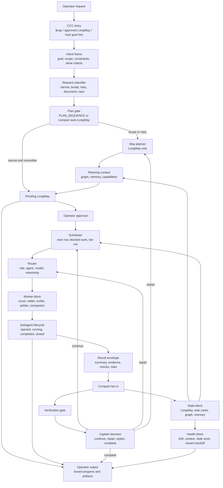
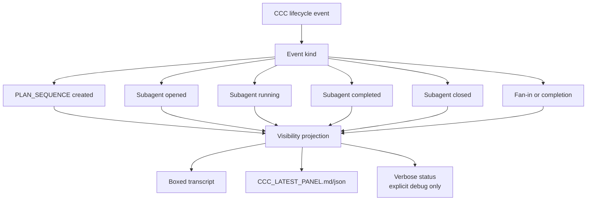

# 0.0.12 Pre-Release Plan

`0.0.12-pre` should make CCC behave less like a collection of useful
projections and more like a small structured Sisyphus harness. The 0.0.11-pre
release made the plan/execute split, app/CLI fallback visibility, and routing
metadata visible enough to test. The next release should make that visibility
and routing deterministic across host Codex app, Codex CLI, git repositories,
and document-centered workspaces.

## Release Goal

0.0.12-pre should tighten four areas:

- structured runtime flow: every `$cap` request should move through input,
  intent, planning, scheduling, routing, execution, fan-in, decision, and output
  blocks without hidden side channels
- operator visibility: app and CLI transcript output should show only the useful
  LongWay progress, checklist, planned rows, and subagent lifecycle details at
  the right time
- workspace state: graph and memory should work for git repositories and for
  document-centered tasks by resolving the target document root instead of
  assuming the current directory is a git repo
- OMO/Sisyphus harness behavior: CCC should repeat a small loop of goal, plan,
  task card, worker, verification, fan-in, and next decision rather than
  growing into a broad foreman-style control surface

## Current 0.0.11-pre Assessment

The current state is usable but not fully coherent.

- PLAN_SEQUENCE correctly stops at `pending_longway_approval` and
  `await_longway_approval`.
- Plan mode routing uses the Way/tactician configuration, currently
  `model=gpt-5.5` and `variant=medium`.
- The boxed app-panel text can show `Progress`, `Checklist`, and `Planned Rows`.
- Planned rows show subagent/model/reasoning when the row carries explicit
  routing metadata.
- When planned rows are supplied only as strings, CCC records them as
  `unassigned` and falls back to the current task route, which can hide the
  intended future worker route.
- General `ccc_status` output is still too verbose for normal operator use.
  The improved boxed transcript exists, but it is not yet the default shape for
  all relevant app/CLI flows.
- App native right-panel rendering is host-owned. CCC should not claim it can
  force that panel to update. The official fallback should be near-native
  transcript output plus stable latest artifacts.
- `assignment_drift=true` is useful but noisy when the mismatch is expected for
  a diagnostic PLAN_SEQUENCE. Drift should become actionable and classified.

## Target Structured Flow

0.0.12-pre should use the following flow as the runtime contract. The diagram is
intentionally block-oriented so each block can be tested and replaced.



## App And CLI Visibility Flow

0.0.12-pre should treat output as a product surface, not as incidental logs.



Default boxed transcript should show only the useful operator surface:

```text
+------------------------------------------------------------------------------+
| CCC LongWay                                                                  |
| Progress: 0/3 completed                                                      |
| Checklist:                                                                   |
| [~] Verify app/CLI visibility                                                |
| [ ] Update release card                                                      |
| Planned Rows:                                                                |
| [ ] Inspect status output -> ccc_scout model=gpt-5.4-mini reasoning=high     |
| [ ] Patch docs -> ccc_scribe model=gpt-5.4-mini reasoning=medium             |
| Subagents:                                                                   |
| ccc_scout running model=gpt-5.4-mini reasoning=high task="Inspect status"    |
+------------------------------------------------------------------------------+
```

Verbose JSON, scheduler details, drift evidence, graph evidence, and token
warnings should be available through explicit debug/status commands, but they
should not dominate ordinary app/CLI transcript output.

## Workspace Graph And Memory Flow

Graph and memory must not assume that useful work always happens inside a git
repository. Many CCC tasks are document tasks: release notes, PDFs, docs
folders, local research files, slide decks, spreadsheets, and other artifacts.
0.0.12-pre should resolve a workspace root from the target object.

```mermaid
flowchart TD
  request["Operator request"]
  targets["Extract target paths<br/>repo, file, directory, document"]
  root_kind["Root resolver"]
  git["Git root"]
  docroot["Document root<br/>nearest stable parent"]
  cwdroot["CWD fallback"]
  state_ns["State namespace"]
  graph["CCC graph"]
  memory["CCC memory"]
  tolaria["Optional Tolaria mirror"]
  planner["Way planning context"]

  request --> targets
  targets --> root_kind
  root_kind -->|inside git repo| git
  root_kind -->|document or non-git folder| docroot
  root_kind -->|no target path| cwdroot
  git --> state_ns
  docroot --> state_ns
  cwdroot --> state_ns
  state_ns --> graph
  state_ns --> memory
  graph --> tolaria
  memory --> tolaria
  graph --> planner
  memory --> planner
```

Root resolution rules:

- If a target path is inside a git worktree, use the git root.
- If the target is a file outside git, use the nearest stable document root.
  Examples: the containing project folder, a release-work version folder, a
  document bundle folder, or the smallest parent that contains the related
  files for the task.
- If multiple target files share a parent, use their common parent.
- If target files are unrelated, create separate graph/memory namespaces and
  make the split visible in the planning context.
- If no path is supplied, use cwd as a fallback and mark the root confidence.
- Tolaria mirror remains optional. If Tolaria is unavailable, local graph and
  memory continue to work.

## Problem Areas And Improvements

### 1. Planned Row Routing Is Not Deterministic Enough

Problem:

- Structured planned rows can show `ccc_scout model=gpt-5.4-mini
  reasoning=high`, but string-only planned rows become `unassigned`.
- This makes app/CLI smoke results depend on which API path created the LongWay.

0.0.12-pre work:

- Normalize string planned rows through the router before storing the LongWay.
- Store `display_role`, `display_agent_id`, `model`, and `reasoning` for every
  planned row.
- Preserve `planned_role=unassigned` only as raw input metadata, not as the
  operator-facing display.
- Add tests for MCP-created string rows and CLI-created structured rows.

Progress:

- Implemented the first slice: string-only planned rows keep their raw
  `planned_role=unassigned` / `planned_agent_id=unassigned` values, but now
  receive operator-facing `display_role`, `display_agent_id`, `model`,
  `variant`, and `reasoning` metadata during LongWay bootstrap.
- The app-panel projection now prefers `display_role` and `display_agent_id`
  before falling back to raw planned routing or the current task route.
- Smoke result: a PLAN_SEQUENCE created with string rows
  `Inspect visible progress` and `Document visible result` now renders:
  `ccc_scout model=gpt-5.4-mini reasoning=high` and
  `ccc_scribe model=gpt-5.4-mini reasoning=medium`.
- Remaining: replace the initial row-title heuristic with the full phase-aware
  router once scheduler-owned row materialization is tightened.

### 2. Output Is Still Split Between Useful Boxes And Verbose Status

Problem:

- The boxed transcript is readable, but ordinary status output can still print
  too much scheduler, drift, graph, and cost-routing detail.
- Users should not have to know which command produces the readable surface.

0.0.12-pre work:

- Make compact boxed output the default for app/CLI operator-facing status after
  CCC lifecycle events.
- Move verbose details behind explicit `--verbose`, `--debug`, or JSON output.
- Print subagent lifecycle lines automatically when subagents are opened,
  running, completed, and closed.
- Refresh `CCC_LATEST_PANEL.md/json` after each lifecycle event.
- Subagent update text now renders a compact boxed transcript with
  `opened/running/completed/closed` labels, child agent, role, model,
  reasoning, task/lane, optional summary, and next actor. JSON and quiet output
  stay available for automation.

### 3. Assignment Drift Needs Better Classification

Problem:

- A PLAN_SEQUENCE can correctly route the current task to Way/tactician while a
  diagnostic request classifier expected explorer/scout, producing noisy
  `assignment_drift=true`.

0.0.12-pre work:

- Separate `planning_route` from `execution_route`.
- Treat Way/tactician as valid for PLAN_SEQUENCE even when the eventual
  execution row should use scout/scribe/raider/arbiter.
- Show drift only when the selected route is unsafe for the current phase.
- Record drift severity: `info`, `warning`, `blocking`.

Progress:

- Implemented the phase-aware planning route slice.
- `PLAN_SEQUENCE` now treats Way/tactician as a valid planning route and records
  `route_relation=planning_route_valid_execution_route_deferred`.
- The execution expectation remains visible through
  `execution_expected_family`, `execution_expected_roles`, and
  `execution_expected_agent_ids`.
- Context health now uses `drift_severity`; informational drift does not block
  the run.
- Smoke result: diagnostic PLAN_SEQUENCE status reports
  `assignment_drift=false`, `assignment_drift_severity=info`,
  `context_health.status=ok`, while planned rows still show
  `ccc_scout`/`ccc_scribe` future execution routes.

### 4. Scheduler Must Own The Loop More Explicitly

Problem:

- Scheduler projections exist, but the perceived flow can still look like
  Captain/Way/status are coordinating ad hoc.

0.0.12-pre work:

- Make Scheduler the only block that materializes the next planned row after
  approval.
- Store a scheduler decision record for each row transition.
- Include selected row, route, blocked reason, fan-out state, and next expected
  lifecycle event.
- Keep Way limited to LongWay planning.

### 5. Document-Centered Workspaces Need First-Class State

Problem:

- Graph and memory are strongest when the task is inside a git repo.
- Non-git document tasks need the same graph/memory support based on the target
  document root.

0.0.12-pre work:

- Implement target path extraction from operator requests, file mentions, and
  artifact paths.
- Add a workspace-root resolver that supports git root, document root, common
  parent, and cwd fallback.
- Namespace graph and memory by resolved root and root kind.
- Mirror document-root graph/memory to Tolaria when configured.
- Expose root kind and confidence in planning context.

Progress:

- Implemented the first target-root resolver slice for PLAN_SEQUENCE planning
  context.
- Planning context now records `workspace_root.root`, `root_kind`,
  `confidence`, `confirmation_required`, `reason`, and candidate roots.
- Graph and memory status are read from the resolved target root instead of
  blindly using the host cwd.
- If cwd is not a git repo but the request mentions a file or directory inside
  a target repo, CCC resolves the git root and uses that repo for graph and
  memory.
- If cwd is not a git repo and contains multiple child repos without an
  explicit target path, CCC marks the root as
  `ambiguous_child_git_repos` with `confirmation_required=true` so the operator
  can confirm the intended repo.
- App/CLI boxed LongWay visibility now shows a concise target-root confirmation
  line only when `confirmation_required=true`, while resolved target roots stay
  quiet.
- Boxed LongWay visibility now includes a top progress gauge derived from
  completed/total LongWay phases, so operators can scan progress like a compact
  `tqdm` bar.
- Target path extraction now handles Markdown link targets, path-like request
  spans, absolute or home-relative paths, line suffixes, and paths containing
  spaces. Ancestor/descendant duplicate candidates are collapsed to the more
  specific target root so a parent cwd does not make a mentioned child repo look
  ambiguous.
- The target workspace resolver has been split into a dedicated
  `target_workspace` module with concise comments. `run_bootstrap` now consumes
  a small resolver API instead of owning path parsing, git/document root
  detection, and ambiguity handling inline.
- Multiple non-git document files under one bundle now resolve to the shared
  bundle parent with `root_kind=document_root` and `confidence=medium`. This
  covers work such as versioned release folders, document packs, and local
  artifact bundles where the operator mentions files in sibling subfolders.
- Unrelated non-git document roots stay `ambiguous_target` with
  `confirmation_required=true` instead of collapsing to the host cwd, so CCC can
  ask for the intended target root before graph/memory state is trusted.
- App/CLI boxed LongWay output now turns `confirmation_required=true` into an
  actionable target-root prompt. It shows a small numbered candidate list and a
  copyable `$cap Use target_paths=[...]` follow-up hint, while resolved roots
  stay quiet to avoid extra transcript noise.
- `ccc_start` and `ccc_run` now accept structured target mention aliases:
  `target_paths`, `file_paths`, `artifact_paths`, `mentioned_files`,
  `input_items`, and `items`. The resolver ingests only path-like fields from
  those structures, so host attachment metadata can drive graph/memory root
  selection without treating arbitrary prompt text as target evidence.
- Non-git document roots can now build a local CCC graph store when graph
  update is explicitly requested. The graph index includes Markdown headings as
  symbols and relative Markdown links as graph edges, so document packs can
  provide bounded planning evidence even without a git repository.
- Existing non-git parent-folder behavior is preserved: a missing graph store
  still reports an actionable non-blocking warning, and ambiguous child repo
  graph stores still require disambiguation instead of guessing.
- Tolaria graph mirrors now use the same workspace namespace shape as memory:
  `ccc/repos/<root-slug>/graph.md` and `ccc/repos/<root-slug>/memory.md`. This
  applies to git repos and non-git document roots, and a missing local
  document-root graph can be restored from Tolaria when mirroring is explicitly
  enabled.
- App/CLI boxed LongWay visibility now includes a compact `Workspace State`
  section only when graph or memory context exists. It shows graph availability,
  indexed file count, memory entries, and Tolaria mirror note paths without
  dumping raw graph or memory payloads into ordinary transcript output.
- Remaining: add stronger end-to-end smoke coverage for graph/memory context
  inside the full Sisyphus loop.

### 6. OMO/Sisyphus Harness Compatibility

Problem:

- CCC has many primitives, but the operator wants the repeated harness loop to
  feel as simple and deterministic as OMO/Sisyphus.

0.0.12-pre work:

- Define a small state machine:
  `intent -> plan -> approve -> schedule -> route -> lifecycle -> fan-in ->
  decide`.
- Ensure every user intervention re-enters through input/intent and patches the
  current LongWay, active task, or pending row.
- Keep Captain as the decision point, not a hidden worker.
- Keep worker outputs as Result Envelopes and make Compact Fan-in the only
  source used for Captain decisions.
- Add harness tests that cover continue, repair, replan, complete, and restart
  handoff.

### 7. Skill SSL Manifest For Routing And Risk

Problem:

- `SKILL.md` and custom-agent instructions remain the right human-readable
  source of behavior, constraints, examples, and failure modes.
- Router, Scheduler, Way, Sentinel, and Arbiter still need small structured
  evidence about when a skill should run, what execution phases it uses, and
  what side effects or risk it carries.
- This structured evidence should not replace runtime truth. Persisted run
  state, task cards, lifecycle artifacts, fan-in, and verification remain the
  source of what actually happened.

0.0.12-pre work:

- Introduce an optional Skill SSL manifest sidecar for low-risk agents first.
- Define SSL for CCC as:
  - Scheduling: when the skill or custom agent should be considered, expected
    inputs/outputs, role family, and route hints.
  - Structural: the skill's expected execution scenes or phases.
  - Logical: atomic actions, tools/resources, side effects, risk level, and
    approval requirements.
- Keep `SKILL.md` canonical for humans. The manifest is advisory
  machine-readable evidence for Router, Sentinel/Arbiter, and Way planning
  context.
- Integrate first with:
  - Router planned-row display and route selection evidence.
  - Sentinel/Arbiter risk precheck evidence.
  - Way planning context as capability/structure hints only.
- Keep Captain decision-making, lifecycle truth, fan-in truth, and persisted run
  truth outside the manifest.
- If a manifest is missing, stale, or invalid, continue with existing
  `SKILL.md + ccc-config.toml` behavior.

Progress:

- Added optional `skills/ssl/*.skill.ssl.json` sidecars for `ccc_scout` and
  `ccc_scribe` as the first low-risk/read-mostly examples.
- Added a non-blocking manifest parser that validates only the three top-level
  SSL sections: `scheduling`, `structural`, and `logical`.
- Delegation plans now include `skill_ssl_manifest` advisory evidence for
  spawnable custom agents. Missing or invalid manifests have `blocking=false`
  and fall back to `SKILL.md + ccc-config.toml`.
- This is part of 0.0.12-pre, not only a 0.0.13 idea. The 0.0.13 direction is
  to deepen usage of these manifests in Router/Sentinel/Arbiter/Way once the
  0.0.12 scheduler and visibility requirements are complete.

Minimal manifest shape:

```json
{
  "skill_id": "ccc_scout",
  "version": "0.1",
  "scheduling": {
    "role_family": "read_only_exploration",
    "display_agent_id": "ccc_scout",
    "preferred_model_family": "mini",
    "preferred_reasoning": "high",
    "intent_signatures": ["inspect repository", "collect evidence"],
    "expected_inputs": ["task_card", "target_paths"],
    "expected_outputs": ["evidence_summary", "open_questions"],
    "mutation_allowed": false
  },
  "structural": {
    "scenes": [
      { "id": "scope_targets", "description": "Identify target files." },
      { "id": "read_evidence", "description": "Collect evidence." },
      { "id": "summarize_findings", "description": "Return findings." }
    ]
  },
  "logical": {
    "actions": [
      {
        "action": "read_file",
        "resource": "target_paths",
        "side_effect": "none",
        "risk": "low"
      }
    ],
    "requires_operator_approval": false,
    "external_side_effects": false
  }
}
```

0.0.13-pre direction:

- Expand Skill SSL manifests from advisory evidence to first-class Router and
  Sentinel/Arbiter inputs.
- Add manifest freshness checks and schema versioning.
- Use Structural scenes to improve Way's LongWay row templates.
- Keep the same fallback rule: invalid or missing manifests are never release
  blockers and never override lifecycle/fan-in truth.

## 0.0.12-pre LongWay

1. **Visibility Normalization**
   - Normalize all planned rows, including string-only MCP rows, into
     display-ready route metadata.
   - Make compact boxed output the default operator-facing transcript surface.
   - Add subagent lifecycle transcript lines and latest artifact refreshes.
   - Acceptance: app and CLI smoke both show the same `Progress`, `Checklist`,
     `Planned Rows`, and subagent lifecycle fields without extra noise.
   - Progress: first slice completed for string-row display metadata and
     app-panel planned-row display preference.
   - Progress: subagent lifecycle `--text` output now uses the same compact
     boxed transcript style and covers opened, running, completed, and closed
     lifecycle events without printing the full status payload.

2. **Phase-Aware Routing And Drift**
   - Split planning route from execution route.
   - PLAN_SEQUENCE uses Way/tactician by design.
   - Planned rows use their future execution specialists.
   - Drift is only blocking when unsafe for the current phase.
   - Acceptance: diagnostic PLAN_SEQUENCE no longer reports blocking drift just
     because execution rows are scout/scribe while planning is Way.
   - Progress: planning-route classification now marks valid PLAN_SEQUENCE
     Way/tactician routing as matched with `drift_severity=info`, and context
     health no longer treats that as a blocking conflict.

3. **Scheduler-Owned Row Materialization**
   - Promote scheduler transition records to first-class artifacts.
   - Materialize approved rows through Scheduler only.
   - Record selected row, selected route, blocked reason, fan-out, and lifecycle
     expectation.
   - Acceptance: every row transition can be explained from scheduler state
     without inferring from task cards.
   - Progress: planned-row materialization now writes
     `scheduler/transitions/transition-000N.json` records with the selected
     row, selected task card, route/model/reasoning evidence, blocked state,
     fan-out summary, and expected next lifecycle event. `ccc_status`
     projects the latest transition under `scheduler.latest_transition` so App
     and CLI surfaces can explain row selection from scheduler-owned state.

4. **Document Root Graph And Memory**
   - Resolve target roots for git and non-git work.
   - Store graph/memory under root namespaces.
   - Support optional Tolaria mirror for document-root graph and memory.
   - Acceptance: a task targeting a document outside git can build planning
     context from that document's top-level folder and continue if Tolaria is
     absent.
   - Progress: PLAN_SEQUENCE planning context now resolves explicit target
     paths, current git roots, single child git repos, ambiguous child repos,
     document roots, and cwd fallback; graph and memory projections use the
     resolved root and expose confidence/confirmation metadata. The app/CLI
     LongWay box now surfaces ambiguous root confirmation and includes a compact
     progress gauge. Markdown link targets and paths with spaces are now covered
     by regression tests. Target root detection has been modularized into a
     focused resolver module. Non-git document bundles with related files in
     sibling subfolders now resolve to their common bundle parent, while
     unrelated document folders remain confirmation-required. Confirmation
     required roots now render candidate labels plus a copyable `$cap Use
     target_paths=[...]` retry hint in the boxed app/CLI surface. Structured
     host file/artifact mentions now flow through the same resolver via
     `target_paths`, `file_paths`, `artifact_paths`, `mentioned_files`,
     `input_items`, and `items`, including object fields such as `path`,
     `file_path`, `artifact_path`, `target_path`, `absolute_path`, and `uri`.
     Document roots can now be indexed directly with `ccc graph update=true`;
     Markdown headings and local Markdown links become graph evidence while
     missing or ambiguous stores remain non-blocking and explicit.
     Tolaria graph mirrors now land beside memory under
     `ccc/repos/<root-slug>/graph.md`, including non-git document roots, and
     explicit Tolaria-enabled reads can restore a missing local document graph.
     App/CLI LongWay panels now surface concise graph/memory/Tolaria state when
     present, while keeping raw graph and memory payloads out of default output.

5. **Sisyphus Harness Tests**
   - Add end-to-end smoke tests for plan, approve, subagent lifecycle, fan-in,
     replan, complete, and restart handoff.
   - Add app/CLI visibility smoke tests for boxed transcript and latest
     artifacts.
   - Acceptance: 0.0.12-pre can demonstrate the harness loop with a small task
     and with a document-centered non-git task.
   - Progress: the Sisyphus diagram conformance smoke now covers
     PLAN_SEQUENCE creation, pending approval, Scheduler planned-row
     materialization, route selection, subagent fan-in, context health, restart
     handoff, latest app-panel artifacts, completion, terminal scheduler
     state, and completed app-panel projection in one bounded run.

6. **Skill SSL Manifest Slice**
   - Add optional `*.skill.ssl.json` sidecars for low-risk agents first.
   - Attach validated manifest evidence to delegation plans without replacing
     `SKILL.md` or `ccc-config.toml`.
   - Keep missing/invalid manifests non-blocking.
   - Acceptance: Router/Sentinel/Way can see advisory scheduling, structural,
     and logical evidence when present, and fallback behavior is unchanged when
     absent.
   - Progress: first slice implemented for `ccc_scout` and `ccc_scribe` with
     parser tests and delegation-plan evidence.

## Test Plan

- Unit tests:
  - planned row normalization for string and structured inputs
  - route display projection for scout, scribe, raider, arbiter, companions
  - phase-aware drift classification
  - document root resolver
  - graph/memory namespace selection
  - skill SSL manifest parsing, invalid-manifest fallback, and delegation-plan
    advisory evidence

- CLI smoke:
  - create PLAN_SEQUENCE with string planned rows
  - create PLAN_SEQUENCE with structured planned rows
  - approve LongWay and materialize rows through Scheduler
  - record subagent opened/running/completed/closed
  - confirm compact boxed transcript remains concise

- Codex App smoke:
  - verify assistant transcript shows the compact box naturally
  - verify `CCC_LATEST_PANEL.md/json` updates after each lifecycle event
  - classify native right panel as host-owned and not a release blocker

- Document workspace smoke:
  - target a file outside a git repo
  - resolve document root
  - create graph/memory namespace
  - plan with graph/memory context
  - verify Tolaria absence keeps local behavior working

## Acceptance Criteria

- PLAN_SEQUENCE always uses Way/tactician model configuration for planning.
- Planned rows always display future subagent/model/reasoning, regardless of
  whether the input was string-only or structured.
- App and CLI operator-facing output is compact by default.
- Subagent lifecycle updates appear naturally without requiring a separate
  status request.
- Scheduler state explains row transitions.
- Drift classification is phase-aware and not noisy for valid planning routes.
- Graph and memory work for git repo roots and non-git document roots.
- Tolaria remains optional and non-blocking.
- Skill SSL manifests are optional and non-blocking; when present, delegation
  plans expose Scheduling/Structural/Logical advisory evidence without making it
  runtime truth.
- The Sisyphus loop can be demonstrated end to end from a small task.
