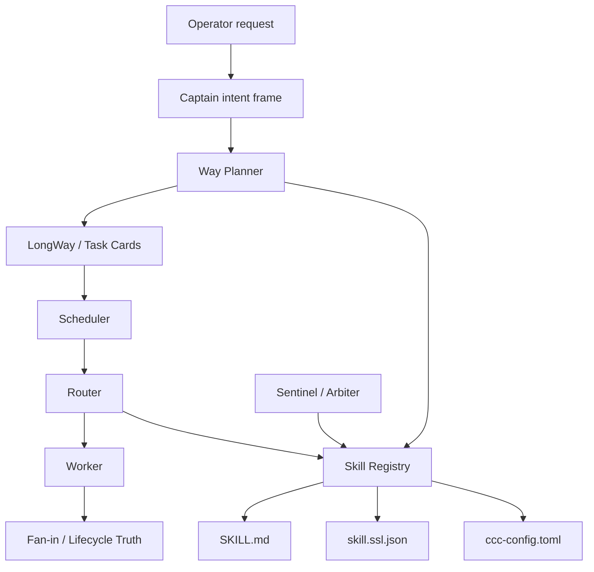
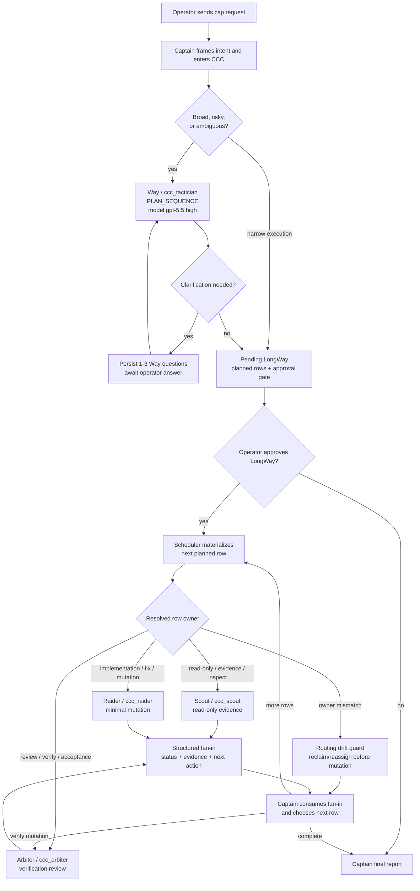

# 0.0.13 Pre-Release Plan

`0.0.13-pre` is the Skill Registry hardening release. It should not replace
CCC's existing Captain, Way, Scheduler, Router, Worker, fan-in, or lifecycle
architecture. The public docs for this release should describe `$cap` as the
entrypoint, prefer quiet `ran` lifecycle commands, keep `checklist`/`status`
rows concise, and treat the SSL Skill Registry as bounded evidence rather than
runtime truth.

## Release Name

Candidate names:

- `0.0.13-pre: Skill Registry Hardening`
- `0.0.13-pre: SSL-backed Skill Registry`

## Release Goal

0.0.13-pre should turn the 0.0.12 optional SSL sidecar experiment into a more
coherent skill registry if, and only if, the 0.0.12 results show that manifests
improve routing, risk, planning context, and operator visibility without
breaking fallback behavior. The release-facing docs should also make the
configured `ccc_*` custom agents, opt-in `ccc memory`, specialist fan-in, and
arbiter review gate explicit.

The intended shape is:

```text
SKILL.md        = human-readable instructions, constraints, examples, failures
skill.ssl.json  = machine-readable scheduling, structure, and risk evidence
ccc-config.toml = model, variant, execution, and role policy
Skill Registry  = unified lookup layer over SKILL.md + SSL + config
```

## 0.0.12 Evaluation Gate

0.0.13-pre starts by reviewing whether the 0.0.12 optional SSL manifest layer
actually improved the system. Do not promote SSL into a stronger registry until
these questions have evidence:

- Did planned row routing become more accurate?
- Did scout/scribe/raider/arbiter/sentinel assignment drift decrease?
- Did risk decisions become easier to explain?
- Did Way planning reflect agent capabilities more accurately?
- Did manifest fallback remain stable when manifests were missing or invalid?
- Did `SKILL.md` and SSL manifests stay aligned?
- Did operator-facing output stay compact after adding manifest evidence?

If these answers are weak, keep SSL advisory-only and focus 0.0.13 on
instrumentation, drift detection, and docs. If they are strong, promote SSL into
the Skill Registry described below.

### 0.0.12 App/CLI Smoke Findings

Observed after installing `0.0.12-pre`:

- Codex App smoke passed for the intended fallback surface:
  - `ccc check-install` reported `status=ok`, `version=0.0.12-pre`,
    `restart=not-required`, and `custom_agents=matching_sync`.
  - `PLAN_SEQUENCE` created a pending LongWay and stopped at
    `next_step=await_longway_approval`.
  - App transcript showed the boxed `CCC LongWay` block with `Progress`,
    `Gauge`, `Checklist`, and `Planned Rows`.
  - Planned rows showed `ccc_scout model=gpt-5.4-mini reasoning=high`.
  - Current planning task used `way/tactician model=gpt-5.5 variant=medium`.
- CLI smoke passed for the boxed app-panel status surface:
  - `ccc --version` reported `0.0.12-pre`.
  - `ccc status --app-panel --text` rendered bordered output with progress
    gauge, checklist, planned rows, and agent/model/reasoning projection.
  - CLI stayed at `PLAN_SEQUENCE`, `stage=planning`,
    `next=await_longway_approval`, and `can_advance=false`.

No release-blocking runtime issue was found in these smoke checks.

Follow-up improvements for 0.0.13-pre:

- Planned-row input can include a requested reasoning value, but display may
  resolve to the role-config reasoning. 0.0.13 now surfaces the displayed
  agent/model/reasoning source triplet instead of a single ambiguous source.
- App smoke from a parent directory with multiple child repos correctly raises a
  target-root confirmation warning. 0.0.13 now keeps the warning compact and
  exposes a structured one-line retry command.
- `ccc start` without `--text` emits a large JSON payload in CLI smoke. 0.0.13
  should improve operator guidance toward `--text`, `--quiet`, or a dedicated
  smoke helper so common visibility tests remain readable.
- The release notes and README set should stay in sync on the quiet lifecycle
  contract, configured `ccc_*` custom agents, SSL Skill Registry availability,
  memory opt-in default, and supported platform list.

## Target Architecture

0.0.13-pre should keep the existing CCC runtime blocks and add one lookup layer:



The registry should answer bounded questions:

- Which agents are eligible for this row?
- What model/reasoning defaults should be displayed?
- Which structural scenes can help Way create a LongWay?
- Which logical actions imply file mutation, shell execution, release mutation,
  network access, approval, or review?
- Is the manifest missing, stale, invalid, or drifting from `SKILL.md`?

The registry should not decide runtime truth. It is evidence, not execution
state.

## Truth Priority

0.0.13-pre must preserve this priority order:

1. Persisted run state, lifecycle artifacts, and fan-in
2. Approved LongWay and task cards
3. `ccc-config.toml`
4. `skill.ssl.json`
5. `SKILL.md`

The SSL manifest describes what a skill usually does. It does not prove what a
worker actually did. Runtime truth remains persisted run state, lifecycle, and
fan-in.

## Problem Areas And Improvements

### 1. Skill Registry Layer

Problem:

- 0.0.12 attaches SSL manifest evidence to delegation plans, but the lookup is
  still small and sidecar-oriented.
- Router, Way, Sentinel, and Arbiter should not each reinvent manifest loading,
  fallback, freshness checks, and drift handling.

0.0.13-pre work:

- Add a `Skill Registry` module that loads `SKILL.md`, `skill.ssl.json`, and
  role config as one query surface.
- Keep missing or invalid manifests non-blocking.
- Return a structured registry status for each skill:
  `available`, `missing`, `invalid`, `stale`, or `drift_detected`.
- Expose the registry source used by each route decision.

Acceptance:

- Router can ask the registry for agent eligibility and display metadata.
- Sentinel/Arbiter can ask the registry for side-effect and risk metadata.
- Way can ask the registry for structural scenes.
- Registry status/debug output shows fallback reason clearly.

### 2. Manifest Schema Stabilization

Problem:

- 0.0.12 validates only three top-level sections:
  `scheduling`, `structural`, and `logical`.
- 0.0.13 needs a stable schema that remains small enough to maintain.

0.0.13-pre work:

- Version the schema explicitly.
- Keep the top-level sections fixed:
  - `scheduling`
  - `structural`
  - `logical`
- Define minimal required fields for low-risk routing and risk review.
- Add parser tests for valid, missing, invalid, stale, and incompatible
  versions.

Out of scope:

- A large workflow DSL.
- Making manifests mandatory.
- Replacing custom-agent developer instructions.

### 3. Full Agent Coverage

Problem:

- 0.0.12 starts with `ccc_scout` and `ccc_scribe`.
- The registry is not useful enough until all managed custom agents have
  manifests.

0.0.13-pre work:

- Add manifests for:
  - `ccc_tactician`
  - `ccc_scout`
  - `ccc_raider`
  - `ccc_scribe`
  - `ccc_arbiter`
  - `ccc_sentinel`
  - `ccc_companion_reader`
  - `ccc_companion_operator`
- Start mutation-heavy manifests conservatively, especially `ccc_raider` and
  release/GitHub operator paths.
- Mark actions with explicit side effects and approval/review expectations.

Acceptance:

- Every managed custom agent has scheduling, structural, and logical evidence.
- Mutation agents expose side effects and risk in the logical layer.
- Read-only agents remain low-risk and non-mutating.

### 4. Router Integration

Problem:

- Planned row display metadata improved in 0.0.12, but routing still depends on
  heuristics and role config more than structured skill evidence.

0.0.13-pre work:

- Let Router use Scheduling metadata as a first-class routing signal.
- Use `intent_signatures`, `role_family`, `expected_inputs`,
  `expected_outputs`, and `mutation_allowed`.
- Preserve existing `ccc-config.toml` model and variant as policy.
- Log which registry evidence influenced the chosen agent.

Acceptance:

- Planned rows show agent/model/reasoning from a consistent registry-backed
  route decision.
- Route decisions explain whether they used config, SSL scheduling, or fallback
  heuristics.
- Missing manifests continue to route through existing behavior.

### 5. Sentinel And Arbiter Risk Precheck

Problem:

- Risk classification is partly heuristic and partly based on request shape.
- Logical SSL metadata can make side effects easier to explain.

0.0.13-pre work:

- Let Sentinel and Arbiter read Logical metadata:
  - `actions`
  - `resources`
  - `side_effect`
  - `risk`
  - `requires_operator_approval`
  - `external_side_effects`
- Use metadata as advisory risk evidence.
- Keep actual review outcomes based on task results, tests, fan-in, and
  lifecycle truth.

Acceptance:

- Risk precheck can cite manifest side effects.
- Mutation and release operations are easier to classify.
- Manifest risk never overrides concrete failure or fan-in evidence.

### 6. Way Planner Structural Context

Problem:

- Way can plan a LongWay, but agent execution structure is not yet consistently
  visible as planning evidence.

0.0.13-pre work:

- Let Way use Structural scenes as planning context.
- Use scenes to produce better row templates and expected fan-in shapes.
- Keep Way responsible for LongWay creation, not worker execution.

Acceptance:

- LongWay rows can include expected worker scenes when useful.
- Structural scenes help with row sequencing without making LongWay rigid.
- Operator approval remains required for broad PLAN_SEQUENCE work.

### 7. SKILL.md And Manifest Drift

Problem:

- Once manifests become more important, they can drift from `SKILL.md`.

0.0.13-pre work:

- Add drift checks:
  - manifest missing
  - manifest invalid
  - manifest stale version
  - SKILL.md mentions mutation but manifest says read-only
  - manifest says mutation but `SKILL.md` forbids it
- Surface drift as status/debug evidence.
- Keep drift non-blocking at first unless it affects safety-critical mutation.

Acceptance:

- `ccc check-install` or a registry status command can show manifest health.
- Drift is visible before release packaging.
- Safety-relevant drift can become a release blocker.

### 8. Way Clarification Interview Loop

Problem:

- CCC currently has a bounded clarification policy for broad, risky,
  ambiguous, or irreversible work, but it is mostly a preflight intent
  confirmation and prompt instruction.
- `PLAN_SEQUENCE` correctly routes to Way and stops at
  `await_longway_approval`, but `way_clarification_request` is still a
  placeholder instead of a persisted interview state.
- Host Plan Mode cannot be triggered inside Way as a background Codex Plan Mode
  engine, and it must not own the CCC planning result or bypass the structured
  Way clarification loop.

0.0.13-pre work:

- Add a persisted `way_clarification_request` object for broad, risky,
  ambiguous, or irreversible Way requests.
- Store 1-3 high-signal clarification questions, the interpreted intent,
  scope assumptions, risk triggers, and the expected answer shape.
- Stop before LongWay materialization when clarification is required.
- Accept the operator answer as a bounded follow-up and regenerate or amend the
  pending LongWay from the stored clarification state.
- Keep narrow Way work fast: proceed with explicit assumptions instead of
  forcing an interview.
- Make the distinction visible:
  - host Plan Mode as non-authoritative host UI only
  - CCC `PLAN_SEQUENCE` pending LongWay
  - CCC Way clarification interview owned by the configured Way agent

Acceptance:

- Broad or ambiguous Way entry can persist a clarification request instead of
  immediately producing a LongWay.
- Operator answers can be consumed exactly once to create or amend the pending
  LongWay.
- Status/app-panel output shows the current clarification question set and the
  copyable follow-up shape without dumping large internal state.
- Narrow Way requests still proceed directly to pending LongWay with explicit
  assumptions.

### 9. App/CLI Visibility UX Follow-Up

Problem:

- 0.0.12 achieved the boxed transcript fallback, but App and CLI smoke exposed
  a few consistency gaps:
  - host Plan Mode wording can make planning ownership look ambiguous;
  - README and skill text can accidentally present `/plan` or `/goal` as CCC
    entry paths;
  - `ccc checklist --text` does not match the boxed app-panel status format;
  - planned-row reasoning source is not explicit when role config overrides
    caller-provided display metadata;
  - target-root confirmation can be visually heavy for small smoke tests;
  - raw `ccc start` JSON is too noisy for operator-facing smoke flows.

0.0.13-pre work:

- Add concise smoke guidance and examples for direct App execution, CCC-owned
  `PLAN_SEQUENCE`, and CLI execution.
- Keep `ccc checklist --text` aligned with the boxed app-panel surface whenever
  planned rows are present; otherwise keep it as the compact LongWay checklist.
- Show the source of planned-row display metadata when it matters:
  `role_config`, `planned_row_input`, `skill_registry`, or `fallback_heuristic`.
- Keep target-root confirmation in the boxed panel, but compress it to the top
  few candidates plus a single copyable retry command.
- Prefer `--text`/`--quiet` examples in public smoke docs and consider a small
  smoke subcommand or preset if repeated operator testing stays common.

Low-noise smoke examples:

- Codex App direct execution: send `$cap <task>` outside host Plan Mode when the
  expected result is an immediate CCC run.
- Codex App planning smoke: invoke `$cap` directly so CCC creates
  `PLAN_SEQUENCE`; the configured Way agent owns the LongWay.
- CLI status smoke: prefer `ccc status --app-panel --text --json
  '{"run_id":"..."}'` for operator-readable output.
- CLI checklist smoke: prefer `ccc checklist --text --json '{"run_id":"..."}'`
  when the test only needs LongWay/checklist state.
- CLI low-noise lifecycle smoke: use `ccc status --quiet --json
  '{"run_id":"..."}'` when scripts only need `status`, `stage`, `next`, and
  `can_advance`.
- Codex-hosted lifecycle mutation smoke: prefer `ccc start`, `ccc orchestrate`,
  `ccc subagent-update`, and `ccc memory` with `--quiet --json-file` or
  `--quiet --json` so operator-visible steps appear as `ran`; reserve MCP calls
  for app/structured inspection or CLI-unavailable fallback.

Acceptance:

- App and CLI smoke instructions produce the intended execution path without
  relying on hidden host state.
- Compact/status guidance tells host Codex to prefer quiet CLI lifecycle
  mutation subcommands and reserve MCP calls for structured inspection or CLI
  fallback.
- `status --app-panel --text` and checklist-oriented text output do not
  contradict each other.
- Planned rows explain whether agent/model/reasoning came from config, input,
  registry, or fallback.
- Target-root confirmation remains actionable without overwhelming a small
  smoke transcript.

## 0.0.13-pre LongWay

1. **Evaluate 0.0.12 SSL Results**
   - Review routing accuracy, drift, risk explanations, Way planning context,
     fallback behavior, and operator output.
   - Acceptance: decide whether SSL remains advisory-only or becomes the Skill
     Registry evidence layer.

2. **Skill Registry Module**
   - Build one lookup layer over `SKILL.md`, `skill.ssl.json`, and
     `ccc-config.toml`.
   - Acceptance: Router, Way, Sentinel, and Arbiter can query one bounded
     surface.

3. **Manifest Schema Hardening**
   - Stabilize `scheduling`, `structural`, and `logical`.
   - Acceptance: valid/missing/invalid/stale/incompatible manifests have tests
     and non-blocking fallback semantics.

4. **Full Managed Agent Manifest Coverage**
   - Add or update manifests for all managed custom agents.
   - Acceptance: every managed custom agent exposes route, structure, and risk
     evidence.

5. **Router Integration**
   - Use Scheduling metadata for planned row normalization and route selection.
   - Acceptance: route decisions cite registry evidence and still fall back to
     existing config/heuristics.

6. **Risk Precheck Integration**
   - Use Logical metadata for Sentinel/Arbiter risk evidence.
   - Acceptance: side effects and approval expectations are visible and
     explainable.

7. **Way Structural Context**
   - Use Structural scenes as Way planning context.
   - Acceptance: LongWay rows become more agent-aware without replacing
     operator approval.

8. **Way Clarification Interview Loop**
   - Persist a bounded clarification state for broad, risky, ambiguous, or
     irreversible Way requests.
   - Acceptance: CCC can ask 1-3 high-signal questions, consume the operator
     answer once, and then create or amend the pending LongWay.

9. **Registry Status And Drift Checks**
   - Add status/debug output for registry health.
   - Acceptance: missing/invalid/stale/drifted manifests are visible.

10. **App/CLI Visibility UX Follow-Up**
   - Normalize smoke guidance, checklist text, metadata-source labels, and
     compact target-root warnings.
   - Acceptance: App and CLI smoke output stays readable and explains why each
     planned-row agent/model/reasoning value was displayed.

## Current Implementation Progress

Completed in the first 0.0.13-pre slices:

- Added a modular `skill_registry` wrapper around SSL manifests and role config
  evidence.
- Integrated registry evidence into specialist delegation payloads while
  preserving the existing `skill_ssl_manifest` compatibility surface.
- Added conservative SSL manifests for all managed custom agents:
  `ccc_tactician`, `ccc_scout`, `ccc_raider`, `ccc_scribe`, `ccc_arbiter`,
  `ccc_sentinel`, `ccc_companion_reader`, and `ccc_companion_operator`.
- Added focused registry and managed-agent manifest coverage tests.
- Hardened SSL manifest validation with required `version`, `skill_id`,
  scheduling, structural, and logical fields; stale version and `skill_id`
  drift remain non-blocking status evidence.
- Connected Router shortlist creation to registry Scheduling evidence so route
  selection can cite `skill_registry` when manifest evidence is available and
  fall back to heuristic labels when it is not.
- Added display metadata source precedence for selected agent/model/variant/
  reasoning values: agent identity can come from `skill_registry`, while model,
  variant, and reasoning remain sourced from role config.
- Connected Sentinel/Arbiter review precheck payloads to registry Logical
  evidence so review policy output can cite `skill_registry`, name
  `ccc_sentinel` as the classifier, and select `ccc_arbiter` as the bounded
  review owner for high-risk review paths.
- Connected Way `PLAN_SEQUENCE` planning context to registry Structural scenes
  from `ccc_tactician`, and attached scene ids to generated planned-row routing
  traces so LongWay planning can cite `frame_goal`, `sequence_rows`, and
  `surface_approval` without treating the manifest as runtime truth.
- Added the first persisted Way clarification interview slice: broad or
  ambiguous `PLAN_SEQUENCE` starts now store a bounded
  `way_clarification_request`, stop at `await_operator`, avoid planned-row
  materialization, and expose a copyable follow-up shape.
- Completed the Way clarification answer-consumption path: `ccc_orchestrate`
  can consume the operator answer exactly once through `replan_prompt`,
  regenerate pending LongWay rows, and move the run back to
  `await_longway_approval`.
- Added registry health/drift visibility to `ccc check-install`: managed
  custom-agent SSL manifests now report `skillRegistryHealth` with available
  and non-available counts plus a compact transcript line.
- Completed the planned-row App/CLI visibility slice: app-panel and checklist
  text now show separate agent/model/reasoning source labels instead of a
  single ambiguous source field.
- Completed the compact target-root warning slice: app-panel warnings now carry
  the same copyable `$cap` retry command that boxed text shows for ambiguous
  repo or document-root selection.
- Completed the release/package SSL manifest smoke slice: release asset staging
  now includes `skills/ssl/*.skill.ssl.json`, and the release asset matrix
  verifier fails if any managed-agent manifest is missing or has the wrong
  `skill_id`.
- Completed the planning and low-noise smoke guidance slice in this plan:
  direct `$cap`, CCC-owned `PLAN_SEQUENCE`, app-panel text, checklist text, and
  quiet CLI smoke paths now have explicit examples.
- Completed the release-facing metadata slice: source crate/lockfile version,
  source release index, `v0.0.13-pre` release note, release-repo default
  installers, and README files now point at `0.0.13-pre`; the public release
  repo no longer needs a tracked manifest file.
- Verified with `cargo fmt` and full `cargo test`.
- Additional release script checks passed: `bash -n` for the release builder and
  asset-matrix verifier, `CCC_PRINT_ASSET=1` builder smoke, and a temporary
  package extraction smoke that found all 8 SSL manifests.
- Additional metadata smoke passed: `cargo run -- --version` reported
  `0.0.13-pre`, a refreshed darwin-arm64 release-target package extracted with
  8 SSL manifests, and the packaged binary reported `0.0.13-pre`.
- Completed the local asset publish-prep pass: all 5 release-target binaries
  were rebuilt as `0.0.13-pre`, `scripts/release/verify-release-asset-matrix.sh`
  passed, and release-repo asset digests were recorded.

Post-install real `$cap` smoke findings:

- A real approved LongWay smoke for run
  `6436347d-0308-d913-e3f2-3eb21594dd78` exposed a planned-row
  materialization drift: a row titled as read-only scout evidence had
  `planned_role=unassigned` and materialized as `code specialist`/`raider` with
  `workspace-write` sandbox.
- Captain correctly reclaimed the drifted mutable dispatch before treating it as
  valid evidence, then attempted a real `ccc_scout` read-only evidence lane.
  The scout lane was spawned and lifecycle-recorded, but it did not return
  bounded fan-in within the wait windows and was marked `stalled`.
- A bounded `ccc_raider` patch corrected the materialization path so rows now
  resolve routing from explicit planned metadata, display metadata, agent-id
  mapping, then conservative row-text hints before falling back to
  implementation.
- A focused regression test now covers unassigned read-only/scout planned rows
  materializing as `explorer`/`scout` with `read-only` sandbox, while the
  existing implementation-row materialization test preserves raider behavior.
- `ccc_arbiter` reviewed the patch and found no blocking issue. The remaining
  edge case is intentionally explicit metadata: stale or wrong
  `planned_role`/`display_role` values still win over text inference because
  explicit planner metadata remains higher priority than heuristics.

Additional improvement work from the real smoke:

- Planned-row routing should be generated with explicit role/agent metadata
  during Way planning, not repaired later by materialization heuristics.
- Status/checklist projection should stop showing stale or misleading planned
  row display roles when the persisted row only has `unassigned` routing.
- Host-subagent lifecycle fan-in needs a tighter timeout/retry/reassign path so
  a stalled scout can be replaced by a fresh read-only scout lane without
  forcing degraded captain fallback.
- Review handoff should support an explicit arbiter review lane over a raider
  result without being recorded as policy drift against the current raider task
  card.
- README and public operator docs should remove host `/plan` and `/goal` as
  advertised CCC paths. `$cap` is the entrypoint; host Plan Mode cannot be
  triggered inside Way as a background Codex Plan Mode engine.
- The smoke run should be repeated from a fresh installed `0.0.13-pre` package
  after this fix is rebuilt, installed, and Codex is restarted, because the
  existing run preserves the original drift in historical task-card evidence.

Fresh post-restart `0.0.13-pre` smoke findings:

- Run `1e1eac41-3c85-7aab-f702-a71a7491602b` confirmed the fixed
  materializer path: the read-only evidence row materialized as
  `explorer`/`scout` with `read-only`; the mutation row materialized as
  `code specialist`/`raider` with `workspace-write`; and the verification row
  materialized as `verifier`/`arbiter` with `read-only`.
- Captain consumed persisted fan-in and advanced the planned rows from scout to
  raider to arbiter, so scheduler-owned planned-row progression is working.
- The actual host custom subagents did not return bounded fan-in in the smoke
  window. `ccc_scout`, `ccc_raider`, and `ccc_arbiter` were each spawned and
  lifecycle-recorded, then marked `stalled` after an explicit concise fan-in
  request.
- Recovery fan-in from companion/captain evidence allowed the run to continue,
  but that is degraded behavior. It proves recovery visibility, not the
  normal captain-specialist-captain loop.
- Assignment-quality warning logic over-weighted smoke/status wording and
  reported drift for explicitly planned `raider` and `arbiter` rows. Approved
  planned-row owner metadata must take precedence over text-only diagnostic
  heuristics when the assigned specialist matches the planned owner.

Release-blocking improvement work from this smoke:

- Fix host custom subagent fan-in/reclaim mechanics so a spawned specialist
  either returns the required result envelope or is automatically retried or
  reassigned through a bounded follow-up without manual companion fallback.
- Add a real smoke that asserts lifecycle progression for
  `captain -> ccc_scout -> captain -> ccc_raider -> captain -> ccc_arbiter ->
  captain`, not only planned-row materialization.
- Add status/checklist output that distinguishes `routing materialized`,
  `specialist spawned`, `specialist fan-in received`, and `recovery fallback
  used`; a completed checklist item should not hide a stalled primary
  specialist.
- Treat explicit LongWay planned-row owner metadata as the assignment-quality
  expectation source before applying smoke/status diagnostic heuristics.

Implemented in the harness-flow refresh:

- Generated runtime defaults now use `fallback_specialist_execution_mode =
  codex_exec`. Existing generated defaults that still have
  `visible_degraded_host_fallback` are upgraded by `ccc setup` unless the
  operator has replaced the generated defaults with a custom policy.
- `ccc_subagent_update` records an automatic `subagent_fallback.reason =
  child_timeout` when a host custom subagent is reported as `failed`,
  `stalled`, or `reclaimed` without an explicit fallback reason.
- `ccc_orchestrate` can recover from `await_fan_in` after a stalled host
  custom subagent by launching the same task-card owner through the codex exec
  worker harness, while avoiding duplicate launch if an active worker
  delegation already exists.
- MCP and CLI orchestration output now includes `launch_result` so status
  consumers can see which specialist was launched, whether it completed, and
  which raw-events artifact backs the fan-in path.
- Focused regression coverage proves a stalled host `ccc_raider` update
  records fallback state and a later `ccc_orchestrate` dispatches the `raider`
  through the codex exec harness with completed worker fan-in.

Refreshed installed `0.0.13-pre` smoke follow-up:

- Run `27cfd5be-e738-a84b-cc55-bf12a3eee21a` confirmed the installed
  harness route after restart: scout materialized as
  `explorer`/`scout`/`read-only`, host `ccc_scout` stall recorded
  `subagent_fallback.reason = child_timeout`, codex exec recovered the same
  read-only specialist lane, the controlled no-op mutation row materialized as
  `code specialist`/`raider`/`workspace-write`, and arbiter completed the final
  `verifier`/`arbiter`/`read-only` verification lane.
- Checklist state reached `4/4 completed`, and completed/materialized rows
  rendered as checked checklist items. The worker harness also respected the
  CCC persistence boundary: no direct worker write to CCC run-state files was
  observed in raw-events evidence.
- Remaining improvement: Planned Rows still preserve the primary host
  specialist stall as `[!]` even when codex exec recovery completes the row.
  Status output should render this as a completed recovered row with an
  explicit recovery annotation, not as an ambiguous row failure.
- Remaining improvement: fallback worker prompts are too broad for smoke
  validation. Read-only recovery should be token-bounded and scoped to the
  exact evidence requested so simple routing validation does not spend
  excessive time or token budget.
- Remaining improvement: status/checklist output can still mix completed
  checklist state with nested `Planned: ... [ ]` metadata. Original planned-row
  metadata should be visually separated from current execution state so a
  completed materialized row never looks incomplete.

### Current Specialist Flow And Checkpoints

The intended 0.0.13-pre flow is captain-mediated. The host Codex session should
not directly mutate broad work just because `$cap` was invoked. Captain creates
or resumes CCC state, Way owns planning, and each specialist returns bounded
fan-in before Captain decides the next move.



How to read this flow during testing:

- A planning request should create `PLAN_SEQUENCE` with `Way`/`tactician`; it
  should not end only as a host proposed plan.
- Broad or unclear planning may stop at a persisted clarification request; the
  operator answer should be consumed once and produce or amend a pending
  LongWay.
- A read-only evidence row must route to `ccc_scout` with `read-only` sandbox.
  If it materializes as `ccc_raider` or `workspace-write`, that is a routing
  drift.
- Mutation should happen only after LongWay approval and only on a row that
  resolves to `ccc_raider`.
- Verification should be a separate `ccc_arbiter` fan-in over the mutation
  result, then Captain reports the final outcome.
- Every specialist handoff should leave lifecycle evidence in status/checklist:
  spawned/running/completed/stalled/reclaimed, fan-in summary, evidence paths,
  and Captain's next decision.

Remaining work:

- Operator-owned publication remains: commit coherent source/release-repo
  slices, tag `v0.0.13-pre`, create or update the GitHub pre-release, and push
  from the intended release branch/state.
- After the refreshed local install, rerun the real `$cap` specialist-flow smoke
  to verify fresh persisted evidence for `captain -> scout -> captain ->
  raider -> captain -> arbiter -> captain`, including the codex exec recovery
  path if a host custom subagent stalls.
- Commit and publish the refreshed source and release-repo README wording so
  `/plan` and `/goal` are not presented as CCC entry paths in the public repo.

## Test Plan

- Unit tests:
  - registry loads `SKILL.md`, SSL manifest, and config together
  - missing manifest fallback
  - invalid manifest fallback
  - stale or incompatible version classification
  - full managed agent manifest coverage
  - Router scheduling metadata usage
  - Sentinel/Arbiter logical risk metadata usage
  - Way structural scene context
  - Way clarification request persistence and one-time answer consumption
  - SKILL.md/manifest drift checks
  - unassigned read-only/scout planned rows materialize as
    `explorer`/`scout`/`read-only`

- CLI smoke:
  - create PLAN_SEQUENCE with scout/scribe/raider/arbiter rows
  - create a broad ambiguous Way request and confirm it persists 1-3
    clarification questions before LongWay materialization
  - answer the persisted clarification request and confirm CCC creates or
    amends the pending LongWay exactly once
  - confirm planned rows show registry-backed route evidence with separate
    agent/model/reasoning source labels
  - run risk precheck for read-only, docs mutation, code mutation, and release
    mutation examples
  - confirm fallback when a manifest is missing or invalid

- Codex App smoke:
  - confirm compact boxed output remains readable
  - confirm app-panel artifacts do not dump large registry JSON by default
  - confirm debug artifacts can show registry evidence when requested
  - confirm App planning guidance says CCC `PLAN_SEQUENCE` and the configured
    Way agent own planning, without presenting `/plan` or `/goal` as CCC entry
    paths
  - confirm Way clarification state renders compactly and gives the operator a
    copyable follow-up shape
  - confirm compact target-root warnings include a structured `retry_command`
  - confirm `status --app-panel --text` and checklist text output either share
    the same boxed projection or clearly identify different display modes

- Release/package smoke:
  - `bash -n scripts/release/build-release-asset.sh scripts/release/verify-release-asset-matrix.sh`
  - `CCC_PRINT_ASSET=1 scripts/release/build-release-asset.sh <version> <platform>`
  - temporary package extraction confirms 8 `skills/ssl/*.skill.ssl.json`
    files are present
  - full asset matrix verifies each packaged SSL manifest `skill_id`

- Release smoke:
  - verify manifests are packaged
  - verify install/check-install can inspect manifest health
  - verify invalid manifest does not break normal routing
  - verify public smoke examples prefer low-noise text surfaces
  - after reinstall and restart, run a fresh real `$cap` specialist-flow smoke
    and confirm persisted lifecycle evidence contains scout, raider, arbiter,
    captain fan-in, and no read-only row materializes as raider
  - simulate a stalled host custom subagent and confirm `ccc_orchestrate`
    launches the task-card owner through codex exec with visible
    `launch_result`
  - confirm public README and packaged skill guidance do not tell operators to
    use `/plan` or `/goal` as part of the CCC path
  - confirm `ccc status/checklist --subagents --text` renders concise
    subagent-lane rows without app-panel boxing
  - confirm `ccc status/checklist --projection` writes a single
    workspace-root `CCC_LONGWAY_PROJECTION.md` display artifact that is visible
    through `git diff -- CCC_LONGWAY_PROJECTION.md` on first creation
  - confirm Way creates the plan, captain materializes or refreshes
    `CCC_LONGWAY_PROJECTION.md` after lifecycle updates, and Codex diff shows
    the projection file
  - confirm `ccc recommend-entry` and `ccc auto-entry` are available CLI
    surfaces for `$cap` entry routing, with `auto-entry` syncing the projection
    after run creation
  - confirm terminal host-subagent updates release CCC's active handle and
    status continues to surface when the host still needs to close the finished
    agent thread

## Acceptance Criteria

- 0.0.13 starts from a documented evaluation of 0.0.12 SSL results.
- SKILL.md remains the human-readable instruction source.
- SSL manifests become stronger registry evidence only after the evaluation
  gate passes.
- Runtime truth remains persisted run state, lifecycle, and fan-in.
- Every managed custom agent has SSL manifest coverage or an explicit
  non-blocking missing-manifest reason.
- Router can use Scheduling metadata and cite it.
- Sentinel/Arbiter can use Logical metadata and cite it.
- Way can use Structural scenes as planning context.
- Broad or ambiguous Way requests can persist and consume a bounded
  clarification interview before pending LongWay materialization.
- Missing/invalid/stale manifests fall back safely.
- Operator-facing output remains compact by default.
- App/CLI smoke output explains metadata source and does not require the
  operator to infer why displayed reasoning differs from a requested row value.
- Fresh post-install specialist-flow smoke proves read-only evidence rows route
  to scout before mutation, mutation rows route to raider only after captain
  approval, and arbiter review is recorded as verification rather than policy
  drift.
- Stalled host custom subagent recovery records an explicit fallback reason and
  uses the worker harness to recover specialist fan-in instead of silently
  falling back to captain-local work.
- README/release/skill text presents `$cap` as the CCC entrypoint and avoids
  documenting host `/plan` or `/goal` as supported CCC orchestration paths.
- Operators can inspect subagent-based LongWay progress through a short
  subagent-only text view or a single diff-visible projection artifact without
  relying on unfolded host transcript output.
- Projection artifacts remain display-only; persisted run state, task cards,
  lifecycle, and fan-in remain the truth source.

## Out Of Scope

- Removing `SKILL.md`.
- Making SSL manifests the source of runtime truth.
- Rebuilding Captain decision-making around SSL.
- Treating registry evidence as stronger than fan-in, lifecycle, task cards, or
  approved LongWay.
- Requiring perfect manifest coverage before ordinary CCC work can continue.

## Release Risk

- Registry evidence can become noisy if surfaced too aggressively.
- Manifest drift can create misleading route/risk explanations.
- Mutation-heavy agents need conservative Logical metadata to avoid
  under-reporting risk.
- Way could overfit to Structural scenes if scenes are treated as a rigid
  workflow instead of planning context.
- Clarification interviews can slow narrow work if the gate is too eager, so
  the implementation must preserve the current explicit-assumptions path for
  single-scoped Way requests.
- Historical run evidence can preserve earlier routing drift even after a fix
  lands. Release validation should distinguish old persisted drift from fresh
  post-fix behavior.

## Summary

0.0.13-pre should not be a rewrite. It should be a structured promotion path:

```text
0.0.12-pre
→ optional SSL manifest layer
→ evaluate routing/risk/planning/output impact

0.0.13-pre
→ Skill Registry Hardening
→ stronger Router/Sentinel/Arbiter/Way usage
→ SKILL.md retained
→ runtime truth retained
→ fallback retained
```
