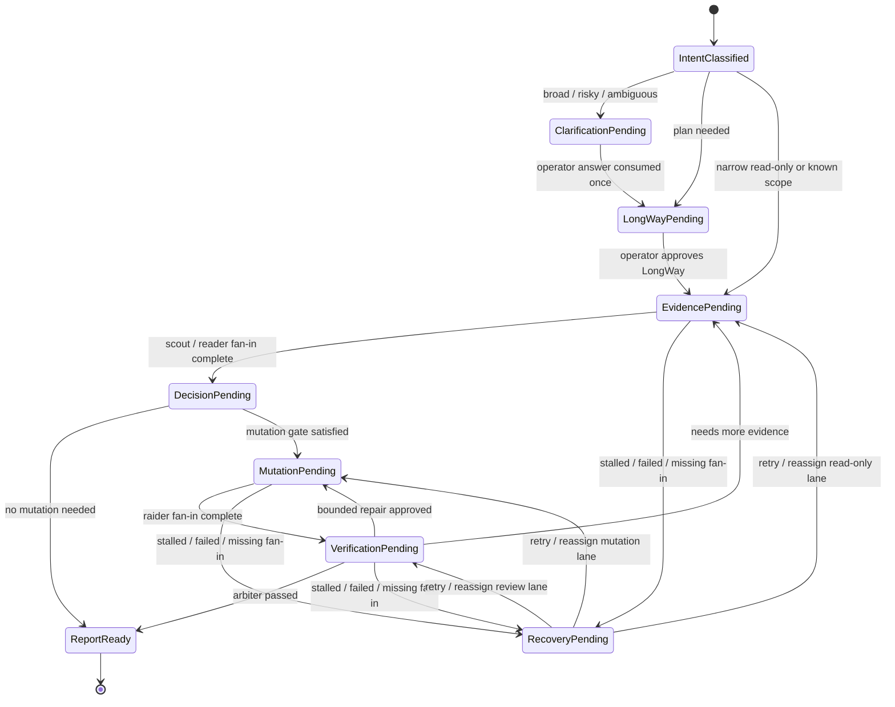

# 0.0.14 Pre-Release Plan

`0.0.14-pre` should turn the 0.0.13 Skill Registry and Way-first
visibility work into a stricter intent-state-machine automation layer. The
release should not make CCC a fixed agent pipeline. It should make Captain
advance only when the current state has the evidence, approval, fan-in, or
review gate required for the next state.

Sprint 9 current status: the local version/install metadata alignment work is complete, `cargo test -p ccc --offline` passed, and the remaining release gates are publication, install/restart verification, and live bundle checks.

## Release Name

Candidate names:

- `0.0.14-pre: Intent State Machine`
- `0.0.14-pre: Gate-Driven Automation`

## Release Goal

0.0.14-pre should make `$cap` automation more accurate for the operator's
intent by replacing implicit or heuristic progression with explicit state
transitions and required gate artifacts.

The intended shape is:

```text
intent classify
-> plan if needed
-> evidence
-> decide
-> mutate only if needed
-> verify
-> report
```

Each step is role-owned, but the role name is not the contract. The contract is
the required output and the transition condition:

1. `captain`: classify request intent, risk, scope, and completion criteria.
2. `ccc_tactician`: for broad or ambiguous work, create a LongWay plan or a
   bounded clarification request.
3. `ccc_scout` or `ccc_companion_reader`: gather current-state evidence and
   cause/risk findings.
4. `captain`: decide whether mutation is required from the evidence and
   approved LongWay state.
5. `ccc_raider`: perform the smallest required mutation only when the mutation
   gate is satisfied.
6. `ccc_arbiter`: verify the mutation result against acceptance and risk
   gates.
7. `captain`: report completion, retry, reassign, or record a fallback based
   on persisted run truth.

Implementation rule:

- While configured `ccc_*` role agents are available, Captain must not mutate
  specialist-owned files or state directly.
- Specialist work must be dispatched to role agents, waited on for fan-in, and
  merged or reviewed from their persisted result before completion is
  reported.
- Terminal fallback or reclaim is a recorded exception, not a normal path, and
  must be visible in the run state instead of hidden in host-local state.

Subagent-first operation is mandatory for specialist-owned work. Captain must
spawn or route to configured `ccc_*` role agents, wait for their fan-in, then
merge and review the result. Host-local implementation, direct file mutation,
or any other Captain-local specialist-owned mutation is blocked while the role
agent path is available.
Fallback/reclaim is only for actual subagent unavailability, capacity
exhaustion, stall, or explicit operator override, and the run must record the
reason and expose it in status, checklist/projection, and launch-result style
surfaces before Captain continues.

## Design Principle

The release should avoid a mechanical chain such as:

```text
explore -> verify -> mutate -> verify
```

That sequence can waste work on read-only requests and can still allow unsafe
mutation if the pre-mutation evidence is weak. A better model is an
intent-based state machine with mandatory gates. Simple read-only requests can
finish after evidence. Risky or user-facing mutation must pass planning,
evidence, mutation, and verification gates.

## State Machine



## Required Gates

### Intent Gate

Purpose:

- Normalize the operator request into intent, risk, scope, completion criteria,
  and task shape.
- Decide whether the request can proceed directly, requires Way planning, or
  needs clarification.

Required output:

- request shape
- mutation intent
- risk level
- recommended entrypoint
- completion discipline
- review policy

Transition rules:

- Broad, risky, ambiguous, or irreversible requests must stop at
  clarification or LongWay approval.
- Narrow read-only work may proceed directly to evidence gathering.
- Mutation work must not proceed directly to `ccc_raider` from raw prompt text.

### Planning And Clarification Gate

Purpose:

- Let `ccc_tactician` create an operator-visible LongWay for broad work.
- Ask 1-3 high-signal questions when the scope is too unclear to plan safely.

Required output:

- pending LongWay rows with role/agent metadata, or
- `way_clarification_request` with questions, expected answer shape,
  assumptions, and a copyable `$cap` follow-up.

Transition rules:

- Clarification answers are consumed exactly once.
- Approved LongWay rows become the scheduling truth.
- Host Plan Mode output must not replace CCC `PLAN_SEQUENCE` state.

### Evidence Gate

Purpose:

- Gather source-grounded current-state evidence before deciding whether
  mutation is required.

Required output:

- summary
- evidence paths
- relevant files or surfaces
- risk notes
- open questions
- recommended next action

Transition rules:

- Read-only work can finish after this gate when acceptance is satisfied.
- Mutation can proceed only when evidence supports a bounded change or the
  operator has approved a LongWay row that already contains sufficient
  evidence.
- If evidence is missing or contradictory, Captain must ask for clarification,
  reassign evidence gathering, or report blocked.

### Mutation Gate

Purpose:

- Prevent `ccc_raider` from running before evidence and scope are clear.

Required output before dispatch:

- approved LongWay row or equivalent persisted task card
- evidence summary or explicit operator-approved mutation scope
- target paths or bounded ownership
- acceptance criteria
- rollback or residual-risk note when relevant

Transition rules:

- `ccc_raider` is skipped for read-only work.
- `ccc_raider` performs minimal mutation only inside the accepted scope.
- Direct Captain mutation remains blocked while configured subagents are
  available. Terminal fallback or reclaim requires recorded subagent
  unavailability, capacity exhaustion, stall, or explicit operator override.

### Verification Gate

Purpose:

- Confirm that mutation satisfied acceptance and did not introduce obvious
  regressions.

Required output:

- verification status
- checks or command evidence
- unresolved findings
- residual risks
- recommendation: pass, repair, reassign, or block

Transition rules:

- User-facing changes, code changes, release changes, and review-sensitive
  mutations require `ccc_arbiter` verification.
- Already-passed verification should not reopen the same review gate unless new
  mutation or new evidence invalidates it.
- Failed verification transitions to bounded repair or blocked status.

### Recovery Gate

Purpose:

- Keep stalled, failed, or missing fan-in from becoming hidden Captain-local
  fallback.

Required output:

- stalled/failed/reclaimed lifecycle event
- fallback reason such as `child_timeout`, `host_subagent_thread_limit`, or
  `parent_override_conflict`
- retry, reassign, close, or terminal fallback decision
- active-handle cleanup and host-close visibility when applicable

Transition rules:

- Captain waits for fan-in, closes completed host threads when possible, or
  records reclaim/reassign/fallback before retrying.
- Terminal fallback/recovery is not a normal execution lane. It is allowed only
  after actual subagent unavailability, capacity exhaustion, stall, or explicit
  operator override, and must be visible through recorded reason,
  `launch_result`, raw events, status, and checklist/projection surfaces.
- Completed recovery should merge into the task-card fan-in before Captain
  reports completion.

### Report Gate

Purpose:

- Ensure the final response is based on persisted CCC truth, not hidden host
  state.

Required output:

- completed items
- skipped or deferred items
- failed or blocked items
- evidence paths
- residual risks
- next recommended action if any

Transition rules:

- Captain can finish only after required fan-in and review gates are collapsed
  into run state.
- Projection/status should show enough state for operator review.

## 0.0.13-pre Findings To Carry Forward

0.0.13-pre provides the right building blocks but does not yet make the full
intent-state-machine contract mandatory across all paths.

Observed strengths:

- `$cap` remains the public entrypoint and CCC run state remains runtime truth.
- Skill Registry evidence is available for all managed custom agents.
- SSL manifests are available for all managed custom agents and provide
  bounded Scheduling, Structural, and Logical evidence for routing, planning,
  and review precheck.
- `ccc check-install` reports registry health with available/non-available
  counts.
- `ccc recommend-entry` and `ccc auto-entry` expose JSON-first entry surfaces.
- Way clarification can persist 1-3 questions and consume an operator answer
  once.
- Planned rows can show separate agent/model/reasoning source labels.
- `ccc status/checklist --projection` writes a stable
  `CCC_LONGWAY_PROJECTION.md` artifact.
- `ccc status/checklist --subagents --text` renders a compact lane-only view.
- Stalled host subagents can record `child_timeout` fallback and launch codex
  exec recovery with `launch_result`.

Observed gaps:

- The system is still closer to role-based routing plus LongWay/review gates
  than to a complete intent-state-machine with mandatory transition artifacts.
- Pre-mutation evidence is not yet a universal hard gate for every mutation
  path.
- `ccc_raider` dispatch should depend on explicit evidence/approval metadata,
  not inferred row text or generic mutation intent.
- Status, checklist, app-panel, and projection surfaces do not always expose
  the same detail. For example, app-panel text can show
  agent/model/reasoning source labels while projection focuses on compact
  task/lane state.
- Codex exec recovery can complete, but an additional orchestration step may be
  needed to merge worker fan-in into the current task card.
- Stalled primary host subagent state can remain visible alongside completed
  recovery, which is useful but can make the row look both failed and recovered
  unless the UI clearly separates primary lane state from recovery state.
- Worker fallback prompts can still be too broad for simple smoke validation.
- Assignment-quality checks need to prefer explicit LongWay planned-row owner
  metadata before applying text-only smoke/status heuristics.
- Projection output should distinguish original planned-row metadata from
  current execution state so completed recovered rows do not look incomplete.

## Problem Areas And Improvements

### 1. State Contract Schema

Problem:

- Current run state contains many useful fields, but there is no single
  compact state contract that says which gate owns the next transition.

0.0.14-pre work:

- Add a state-machine schema with named states, required artifacts, and allowed
  transitions.
- Surface the active gate in `status`, `checklist`, and projection output.
- Preserve existing LongWay/task-card truth priority.

Acceptance:

- Every active run can report the current state, required gate artifact, and
  allowed next transition.
- Invalid transitions are blocked with a compact reason and retry command.

### 2. Evidence-Before-Mutation Enforcement

Problem:

- 0.0.13-pre can route mutation correctly, but it does not fully guarantee that
  `ccc_raider` only runs after evidence or explicit approved scope.

0.0.14-pre work:

- Require an evidence envelope or approved LongWay mutation scope before
  `ccc_raider` dispatch.
- Record the evidence artifact id or approval source on the mutation task card.
- Add a bypass only for explicit operator override or terminal fallback.

Sprint 3 result:

- `ccc_orchestrate` now blocks mutation-capable Codex exec dispatch when the
  active task lacks both persisted evidence and approved LongWay/task-card
  scope.
- The blocked gate is persisted as `mutation_evidence_gate` and mirrored in
  `status.state_contract` so operators can see the missing artifact and next
  recovery actions.

Acceptance:

- Mutation dispatch without evidence or approved scope is blocked.
- Read-only requests never materialize as mutation lanes.
- Tests cover direct mutation prompts, release mutation prompts, and ambiguous
  repair prompts.

### 3. Captain Decision Gate

Problem:

- Captain currently consumes fan-in, but the decision between report,
  mutation, reassign, or clarification should be more explicit.

0.0.14-pre work:

- Add a Captain decision envelope after evidence fan-in.
- Require the envelope to name the chosen next state and cite evidence paths or
  approval ids.

Acceptance:

- Evidence fan-in alone does not implicitly trigger mutation.
- Captain decisions are visible in status/projection and can be audited.

### 4. Recovery Merge Semantics

Problem:

- 0.0.13-pre can launch codex exec recovery after stalled host subagents, but
  recovery completion may require an additional orchestrate step before the run
  appears cleanly merged.

0.0.14-pre work:

- Make recovery fan-in merge explicit and visible.
- Render primary lane state and recovery lane state separately.
- Prefer a single operator-visible command path for recovery launch and merge
  when safe.

Acceptance:

- A stalled host subagent followed by successful codex exec recovery renders as
  recovered, not ambiguously failed.
- `status --subagents --text`, app-panel, and projection agree on whether a
  recovery is active, completed, or awaiting merge.

### 5. Visibility Surface Alignment

Problem:

- Projection, checklist, status JSON, and app-panel text intentionally serve
  different levels of detail, but the differences can hide important routing
  evidence.

0.0.14-pre work:

- Define which fields each surface must show for the active gate.
- Keep projection compact, but add concise gate and recovery annotations.
- Keep app-panel as the richer source for source labels and route metadata.

Acceptance:

- Operators can tell from projection which gate is active and what is blocking
  the next step.
- App-panel/status can show full source labels without contradicting
  projection.

Sprint 5 result:

- Added canonical `post_fan_in_captain_decision` status/attempt truth with
  explicit precedence: terminal/resolve, operator or LongWay approval, review
  pass-cap or needs-work gates, recovery reclaim/retry/reassign, then plain
  advance or dispatch.
- `captain_action_contract`, `scheduler.action`, `state_contract`, app-panel
  payload, and orchestration attempt records now carry or derive from the same
  persisted decision envelope while preserving scheduler-specific planned-row
  and parallel fan-in action labels.
- Focused tests cover collapsed fan-in decision visibility and review
  needs-work precedence over recovery retry.

### 6. Planned-Row Owner Metadata

Problem:

- 0.0.13-pre fixed several routing drift cases, but planned-row materialization
  still needs stronger explicit owner metadata from Way instead of late text
  inference.

0.0.14-pre work:

- Generate role, agent, sandbox, and gate metadata during Way planning.
- Treat explicit planned-row metadata as the first assignment-quality source.
- Use text heuristics only as fallback evidence.

Acceptance:

- Scout rows materialize as read-only evidence lanes.
- Raider rows materialize only when mutation gate requirements are met.
- Arbiter rows materialize as verification lanes, not policy drift.

### 7. Prompt And Token Boundaries

Problem:

- Recovery worker prompts can be broader than the immediate gate requires.

0.0.14-pre work:

- Generate gate-scoped fallback prompts with bounded task, scope, acceptance,
  and evidence requirements.
- Keep smoke/recovery prompts narrow enough to avoid excessive token use.

Acceptance:

- Simple routing or visibility smoke tests do not trigger broad repository
  analysis.
- Worker raw events show the requested gate and bounded evidence contract.

## 0.0.14-pre LongWay

1. **Define State Contract**
   - Add named states, required gate artifacts, allowed transitions, and
     blocked-transition reasons.
   - Acceptance: status can identify the active state and required gate.

2. **Enforce Evidence-Before-Mutation**
   - Block mutation dispatch without scout/reader evidence or approved mutation
     scope.
   - Require Captain to route mutation to configured `ccc_raider` subagents
     while available; direct host mutation is allowed only as recorded
     fallback/override.
   - Acceptance: raider task cards cite evidence or approval source.

3. **Add Captain Decision Envelope**
   - Require Captain to choose report, mutate, clarify, retry, reassign, or
     block after evidence fan-in.
   - Acceptance: decisions are persisted and visible.

4. **Improve Recovery Merge**
   - Separate primary host lane status from codex exec recovery lane status and
     merge completed recovery fan-in predictably.
   - Acceptance: recovered rows render as recovered with evidence, not as an
     ambiguous failure.

5. **Align Visibility Surfaces**
   - Define compact projection fields and richer app-panel/status fields for
     gate, route, source label, and recovery information.
   - Acceptance: projection, app-panel, checklist, and status do not
     contradict each other.

6. **Generate Explicit Planned-Row Metadata Earlier**
   - Way should produce role/agent/sandbox/gate metadata before materialization.
   - Acceptance: assignment-quality checks use explicit owner metadata first.

7. **Tighten Gate-Scoped Worker Prompts**
   - Bound worker and recovery prompts to the active gate.
   - Acceptance: smoke runs remain small and recovery raw events show concise
     gate-scoped instructions.

8. **Regression And Smoke Coverage**
   - Add tests for read-only fast paths, broad clarification, mutation gating,
     recovery merge, and visibility alignment.
   - Acceptance: installed CLI smoke demonstrates
     `intent -> plan if needed -> evidence -> decide -> mutate only if needed
     -> verify -> report`.

## Sprint 2: Subagent Routing Enforcement

Sprint goal:

- Make the 0.0.14-pre docs explicit that `$cap` work must route through the
  configured `ccc_*` subagents when they are available, rather than falling
  back to generic `worker`/`explorer` paths or host-local specialist-owned
  implementation.

Scope:

- Document the routing rule that configured `ccc_*` subagents own
  specialist-work dispatch, fan-in, and review.
- Define the stale generic-worker rejection path for routing drift cases.
- Define the only allowed fallback and reclaim cases: real subagent
  unavailability, exhausted capacity, stall, or explicit operator override.
- Keep the status/checklist/projection visibility requirements concrete so the
  operator can see the active gate, current route, and fallback reason.
- Keep the public `cap` skill aligned but concise if wording needs to change.

Acceptance criteria:

- The docs state that configured `ccc_*` subagents are the default and required
  path for specialist-owned work while available.
- The docs state that stale generic-worker or explorer routes are rejected
  instead of silently accepted as equivalent CCC execution.
- The docs state that host-local specialist-owned mutation is blocked unless
  the run has recorded terminal fallback or explicit override.
- The docs state that fallback/reclaim is allowed only after actual
  unavailability, capacity exhaustion, stall, or explicit operator override.
- The docs state that the current gate, route, and fallback reason must be
  visible in `status`, checklist/projection, and launch-result style output.
- The docs state that completion reports must be based on persisted CCC truth,
  not hidden host state.

Visibility requirements:

- `status` must expose the active gate, active route, and current fallback or
  reclaim state in a form that makes routing drift obvious.
- `checklist` and projection must show the same routing truth in compact form.
- Projection must remain concise, but it must still show whether the run is on
  a configured `ccc_*` subagent path, a fallback path, or blocked on routing.
- If fallback or reclaim is recorded, the reason must be visible rather than
  implied by hidden host state.

Stale routing behavior:

- Any stale generic-worker or explorer suggestion is rejected if it would
  bypass configured `ccc_*` subagents for specialist-owned work.
- The docs should make clear that generic paths are not equivalent to the
  configured CCC route and cannot be used as a silent substitute.
- A reject must point the operator back to the configured CCC route or to an
  explicit override decision.

Fallback and reclaim:

- Reclaim or fallback is allowed only when the configured `ccc_*` path is
  actually unavailable, at capacity, stalled, or explicitly overridden by the
  operator.
- The docs should require the reason to be recorded in run state before the
  captain continues.
- Recovery must stay visible through status and projection until fan-in or
  merge is complete.

Sprint 4 result:

- `ccc status` now derives a bounded `recovery_lane` from
  `host_subagent_state.recovery_recommendation` and
  `host_subagent_state.reclaim_replan_recommendation`, leaving
  `host_subagent_state` as the source of truth.
- Status text and Codex app-panel text render a separate `Recovery` section so
  reclaim/retry/reassign decisions are visible outside planned-row suffixes.
- Compact JSON carries `recovery_lane` at the status root and in the app-panel
  payload for parity with richer status surfaces.

Sprint 6 result:

- App-panel smoke coverage now exercises the `ccc_render_app_panel` tool-call
  structured content, MCP Apps metadata, active gate, recovery lane, and
  transcript text parity.
- Compact app-panel coverage now checks `state_contract`, `recovery_lane`, and
  `post_fan_in_captain_decision` parity with the richer status payload.

Remaining backlog after this sprint:

- Finish the remaining state-contract implementation details for the 0.0.14-pre
  intent-state-machine.
- Finish evidence-before-mutation enforcement for the remaining mutation paths.
- Tighten captain decision and recovery merge semantics where the docs still
  leave implementation details open.
- Add or update smoke coverage for routing drift, fallback visibility, and
  projection alignment.

## Test Plan

- Unit tests:
  - state contract parser and transition validation
  - evidence-before-mutation blocking
  - Captain decision envelope creation
  - planned-row metadata precedence
  - recovery state rendering
  - source-label visibility in app-panel/status
  - projection gate annotations

- Integration tests:
  - read-only request skips `ccc_raider`
  - ambiguous request persists clarification and consumes answer once
  - mutation request blocks until evidence or approved LongWay scope exists
  - successful raider result requires arbiter verification
  - stalled host scout recovers through codex exec and merges fan-in
  - recovered row renders differently from failed unrecovered row

- Installed smoke:
  - `ccc check-install --text`
  - `ccc recommend-entry --json`
  - `ccc auto-entry --json`
  - `ccc start --quiet --json`
  - `ccc status --app-panel --text`
  - `ccc status/checklist --projection`
  - `ccc status/checklist --subagents --text`
  - stalled subagent plus codex exec recovery and merge

## Out Of Scope

- Replacing CCC LongWay/task-card runtime truth with the Skill Registry.
- Making SSL manifests mandatory runtime truth.
- Advertising host `/plan` or `/goal` as CCC entrypoints.
- Forcing every request through every specialist agent.
- Running mutation before evidence just to satisfy a fixed pipeline.
